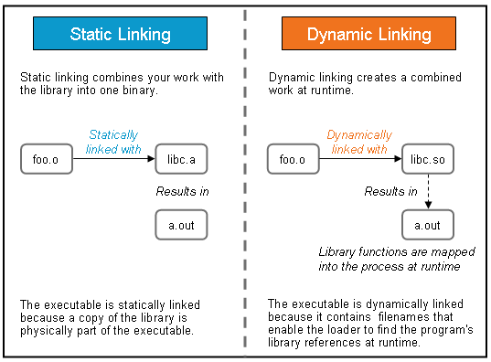

docs from MS：

https://docs.microsoft.com/zh-cn/cpp/cpp/?view=vs-2019


#### Basic


##### namespace

1. 在定义类时，将其放在namespace xxx{}中，而不要直接use namespace xxx；否则引用时会显示找不到该类

##### rvalue

https://www.cnblogs.com/sunchaothu/p/11392116.html


##### union

共用体，也叫联合体，在一个“联合”内可以定义多种不同的数据类型， 一个被说明为该“联合”类型的变量中，允许装入该“联合”所定义的任何一种数据，这些数据共享同一段内存，以达到节省空间的目的。**union变量所占用的内存长度等于最长的成员的内存长度。**

匿名 union 是在没有或的情况下声明的 *`class-name`* *`declarator-list`* 。

> **`union {`** *`member-list`* **`}`**

直接使用在匿名中声明的名称 union ，就像非成员变量一样。 这意味着，匿名中声明的名称在 union 周围范围内必须是唯一的。

匿名 union 受以下其他限制的约束：

- 如果在文件或命名空间范围中声明，则还必须将其声明为 **`static`** 。
- 它只能具有 **`public`** 成员; 匿名拥有 **`private`** 和 **`protected`** 中的成员会 union 生成错误。
- 它不能包含成员函数。

##### extern

1. 多文件开发中分离变量的声明和定义
2. 在多个文件中共享const对象
3. 模版的控制实例化

##### 'extern "C"

https://www.cnblogs.com/skynet/archive/2010/07/10/1774964.html

C语言中并没有重载和类这些特性，故并不像C++那样print(int i)，会被编译为_print_int，而是直接编译为_print等。因此如果直接在C++中调用C的函数会失败，因为连接是调用C中的print(3)时，它会去找_print_int(3)。因此extern "C"的作用就体现出来了。

在C++源文件中的语句前面加上extern "C"，表明它按照类C的编译和连接规约来编译和连接，而不是C++的编译的连接规约。这样在类C的代码中就可以调用C++的函数or变量等。

C++调用C:

```c++
#ifndef C_HEADER
#define C_HEADER
 
extern void print(int i);
 
#endif C_HEADER

//-----------------------

#include <stdio.h>
#include "cHeader.h"
void print(int i)
{
    printf("cHeader %d\n",i);
}

//---------------------

extern "C"{
#include "cHeader.h"
}
 
int main(int argc,char** argv)
{
    print(3);
    return 0;
}
```


##### enum

方法一：

```C++
enum DAY
{
MON=1, TUE, WED, THU, FRI, SAT, SUN
};

```

方法二：

```C++
enum //跟第一个定义不同的是，此处的标号DAY省略，这是允许的。
{
saturday,
sunday = 0,
monday,
tuesday,
wednesday,
thursday,
friday
} workday; //变量workday的类型为枚举型enum DAY
```


方法三：

```C++
typedef enum workday
{
saturday,
sunday = 0,
monday,
tuesday,
wednesday,
thursday,
friday
} workday; //此处的workday为枚举型enum workday的别名
```


##### mutable

mutable也是为了突破const的限制而设置的。被mutable修饰的变量，将永远处于可变的状态，即使在一个const函数中。

如果类的成员函数不会改变对象的状态，那么这个成员函数一般会声明成const的。但是，有些时候，我们需要在const的函数里面修改一些跟类状态无关的数据成员，那么这个数据成员就应该被mutable来修饰。


##### constexpr

向编译器提示变量的值来自于一个提供常量的表达式。


##### volatile

> *A volatile specifier is a hint to a compiler that an object may change its value in ways not specified by the language so that aggressive optimizations must be avoided.*

用它声明的类型变量表示可以被某些编译器未知的因素更改，比如：操作系统、硬件或者其它线程等。遇到这个关键字声明的变量，编译器对访问该变量的代码就不再进行优化，每次使用该变量时**从内存中读取**，而非从寄存器中直接使用，从而可以提供对特殊地址的稳定访问。

>
>
>因此，在 C/C++ 中，对 `volatile` 对象的访问，有编译器优化上的副作用：
>
>- 不允许被优化消失（optimized out）；
>- 于序列上在另一个对 `volatile` 对象的访问之前。
>
>这里提及的「不允许被优化」表示对 `volatile` 变量的访问，编译器不能做任何假设和推理，都必须按部就班地与「内存」进行交互。因此，上述例中「复用寄存器中的值」就是不允许的。
>
>需要注意的是，无论是 C 还是 C++ 的标准，对于 `volatile` 访问的序列性，都有单线程执行的前提。其中 C++ 标准特别提及，这个顺序性在多线程环境里不一定成立。


happens-before:


*尽量使用原子操作解决问题


##### inline func

类的内联函数应该放在**头文件**中定义。如果放在**源文件**中定义，一旦调用则会报错. 因为如果将inline函数

放在.cpp文件中，那么其只对.cpp文件有效.


##### macros

- pounds(#) in the marcros

 https://www.cnblogs.com/yzl050819/p/6022707.html

##连接两个TOKEN

#对参数进行字符串化操作


inline和宏的区别：

- inline函数在编译时展开，宏是预编译时展开
- 内联函数会进行类型检查、语句是否正确等编译功能，宏没有
- 宏要小心处理参数，否则可能有二义性问题。

#### standard lib

##### std::transform

```c++
template <class InputIterator, class OutputIterator, class UnaryOperation>		//一元操作
  OutputIterator transform (InputIterator first1, InputIterator last1,
                            OutputIterator result, UnaryOperation op);
	
template <class InputIterator1, class InputIterator2,							//二元操作
          class OutputIterator, class BinaryOperation>
  OutputIterator transform (InputIterator1 first1, InputIterator1 last1,
                            InputIterator2 first2, OutputIterator result,
                            BinaryOperation binary_op);
```

对从first1位置到last1的每个元素进行op操作，并将结果存入result中。


##### __int64 

__int64 是windows平台的64位整型（LONG LONG）


##### static_cast/dynamic_cast

usage:

```c++
static_cast< new_type >(expression)
dynamic_cast< new_type >(expression)
```


https://blog.csdn.net/u014624623/article/details/79837849

> **static_cast**相当于传统的C语言里的强制转换，该运算符把expression转换为new_type类型，用来强迫隐式转换如non-const对象转为const对象，编译时检查，用于非多态的转换，可以转换指针及其他，**但没有运行时类型检查来保证转换的安全性**。它主要有如下几种用法：
>
> ①**用于类层次结构中基类（父类）和派生类（子类）之间指针或引用的转换**。
> 进行**上行**转换（把派生类的指针或引用转换成基类表示）是**安全**的；
> 进行**下行**转换（把基类指针或引用转换成派生类表示）时，由于没有动态类型检查，所以是**不安全**的。
> ②**用于基本数据类型之间的转换，如把int转换成char，把int转换成enum**。
> ③**把空指针转换成目标类型的空指针**。
> ④**把任何类型的表达式转换成void类型**。
> 注意：static_cast不能转换掉expression的const、volatile、或者__unaligned属性

- const_cast

> 用于改变表达式中的常量性(constness)或易变性(volatileness)，用于以上之外的用于将会被compiler拒绝。
>
> 常用于去掉某个对象的常量性。

- dynamic_cast

> **转换方式：**
> **dynamic_cast< type\* >(e)**
> 　**type**必须是一个类类型且必须是一个有效的指针
> **dynamic_cast< type& >(e)**
> **type**必须是一个类类型且必须是一个左值
> **dynamic_cast< type&& >(e)**
> **type**必须是一个类类型且必须是一个右值
>
> **e的类型必须符合以下三个条件中的任何一个：**
> 1、e的类型是目标类型type的公有派生类
> 2、e的类型是目标type的共有基类
> 3、e的类型就是目标type的类型。

如果一条dynamic_cast语句的转换目标是指针类型并且失败了，则结果为0。如果转换目标是引用类型并且失败了，则dynamic_cast运算符将抛出一个std::bad_cast异常(该异常定义在typeinfo标准库头文件中)。e也可以是一个空指针，结果是所需类型的空指针。

dynamic_cast主要用于类层次间的**上行转换**和**下行转换**，还可以用于**类之间的交叉转换**（cross cast）。

在类层次间进行**上行转换**时，dynamic_cast和static_cast的效果是一样的；在进行**下行转换**时，dynamic_cast具有**类型检查的功能**，比static_cast更安全。dynamic_cast是唯一无法由旧式语法执行的动作，也是唯一**可能耗费重大运行成本**的转型动作。

（1）指针类型
举例，Base为包含至少一个虚函数的基类，Derived是Base的共有派生类，如果有一个指向Base的指针bp，我们可以在运行时将它转换成指向Derived的指针

（2）引用类型

因为不存在所谓空引用，所以引用类型的dynamic_cast转换与指针类型不同，在引用转换失败时，会抛出std::bad_cast异常，该异常定义在头文件typeinfo中。


> *尽量少使用转型操作，尤其是dynamic_cast，耗时较高，会导致性能的下降，尽量使用其他方法替代。


- reinterpret_cast

> 结果和平台息息相关，因此不具备移植性。
>
> 最常用的用途是转换“函数指针”类型。

```c++
typedef void (*FuncPtr)();		//FuncPtr是一个函数
FuncPtr funcArr[10];		//一个数组，元素是指向函数的指针

int doSomething();		//现在有一个这样的函数想放入funcArr中，直接赋值是不行的
funcArr[0] = reinterpret_cast<FuncPtr>(&doSomething);	//可行
```


##### tstring

size_t: **Unsigned integral type**


##### std::array

> 定义于头文件 <array> template<     class T,     std::size_t N  > struct array; (C++11 起) std::array 是封装固定大小数组的容器。


```c++
std::array<int, 10> arr = {1,2,3,4,5,6,7,8,9,0};
std::for_each(arr.begin(), arr.end(), [](int &i){i++;});
for(auto i : arr){std::cout << i << " ";}
```


*与vector的比较

> 1：array 定义的时候必须定义数组的元素个数;而vector 不需要；且只能包含整型字面值常量，枚举常量或者用常量表达式初始化的整型const对象，
> 非const变量以及需要到运行阶段才知道其值的const变量都不能用来定义数组的维度.
>
> 2：array 定义后的空间是固定的了，不能改变；而vector 要灵活得多，可再加或减.
>
> 3：vector有一系列的函数操作，非常方便使用.和vector不同，数组不提供 push_back或者其他的操作在数组中添加新元素，数组一经定义就不允许添加新元素；
> 若需要则要充许分配新的内存空间，再将员数组的元素赋值到新的内存空间。
>
> 4: 数组和vector不同，一个数组不能用另一个数组初始化，也不能将一个数组赋值给另一个数组；


##### std::list

- emplace_back
- push_back

两者区别：

1. 当类型的构造函数中参数多于一个时，push_back只接受该类型的对象；而emplace_back接受直接传这些参数。
2. 当使用内建类型时，两者效率无差别
3. 当使用自定义类型并使用右值传参时，emplace_back效率更高
   - push_back会执行：1. 调用构造函数创建临时对象；2.调用拷贝构造函数给末尾位置的元素赋值该临时对象；3. 析构临时对象
   - Emplace_back：1.根据参数调用构造函数


##### std::prev/std::next

https://en.cppreference.com/w/cpp/iterator/prev


##### defaulted function

```C++
class A {
public:
    // A user-defined
    A(int x){
        cout << "This is a parameterized constructor";
    }

    // Using the default specifier to instruct
    // the compiler to create the default implementation of the constructor.
    A() = default;
};

int main(){
    A a;          //call A()
    A x(1);       //call A(int x)
    cout<<endl;
    return 0;
}
```


#### Pointer

##### Smart Pointer

1. shared_ptr

It implements a smart point using referece counting. Can be 

```c++
int p = new int(1);

shared_ptr<int> p1(p);

shared_ptr<int> p2(p1); //ref cnt ++

shared_ptr<int> p3(p);	// ref cnt doesn't change
```


2. unique_ptr

can be moved, but not copied and assignment. 

Problems:

- thread safety
- have to give specific deleter to release the pointer it holds
- circular reference

```c++
class B;
class A
{
public:
 A(  ) { };
 ~A( )
 {
  cout<<" A is destroyed"<<endl;
 }
 shared_ptr<B> m_sptrB;
};
class B
{
public:
 B( )  { };
 ~B( )
 {
  cout<<" B is destroyed"<<endl;
 }
 shared_ptr<A> m_sptrA;
};

int main(){    
    shared_ptr<B> sptrB( new B );  // sptB count 1
    shared_ptr<A> sptrA( new A );  // sptB count 1
    sptrB->m_sptrA = sptrA;    // sptA count 2
    cout << sptrA.use_count() << endl; //2
    cout << sptrB.use_count() << endl; //1
    sptrA->m_sptrB = sptrB;    // sptB count 2
    cout << sptrA.use_count() << endl; //2
    cout << sptrB.use_count() << endl; //2
    return 0;
}
```


_Ref_count_base

```c++
_Ref_count_base()
	:_uses(1)
  ,_weaks(1)
{}

// sptrB->m_sptrA = sptrA; 实际则是将sptrA的uses+1
```


3. weak_ptr

When cyclic references are unavoidable, or even preferable for some reason, use [weak_ptr](https://docs.microsoft.com/zh-cn/cpp/standard-library/weak-ptr-class?view=msvc-160) to give one or more of the owners a weak reference to another `shared_ptr`.

```c++


class B;
class A
{
public:
 A(  ) { };
 ~A( )
 {
  cout<<" A is destroyed"<<endl;
 }
 weak_ptr<B> m_sptrB;
};
class B
{
public:
 B( )  { };
 ~B( )
 {
  cout<<" B is destroyed"<<endl;
 }
 weak_ptr<A> m_sptrA;
};

int main(){    
    shared_ptr<B> sptrB( new B );  // sptB count 1
    shared_ptr<A> sptrA( new A );  // sptB count 1
    sptrB->m_sptrA = sptrA;    // 实际则是将sptrA的weaks + 1
    cout << sptrA.use_count() << endl; //1
    cout << sptrB.use_count() << endl; //1
    sptrA->m_sptrB = sptrB;    // sptB count 1
    cout << sptrA.use_count() << endl; //1
    cout << sptrB.use_count() << endl; //1
    return 0;
}
```


4. auto_ptr

*不建议使用的类型

当两个auto_ptr对象管理的是同一片内存空间时，调用赋值运算符会导致野指针的产生。


##### diff w reference

没有null reference. 一个reference必须总代表某个对象。如果在设计中，某个对象可能为null，那么不应该用引用去代表它。引用也必须用一个初值进行初始化。之后使用过程中也不需要一直检查是否为null。

指针可以被重新赋值，指向另一个对象。reference总是代表它最初获得的对象。


#### Lambda

- 排序

```c++
sort(vec.begin(), vec.end(), [](const int & a, const int &b){
  	return a < b;s
});
```


#### Object Oriented

##### Constructor

使用初始化列表需要按照成员变量的声明顺序去赋值。


##### Alignment

char, short: start at 2x

int, long, float: start at 4x

double, long long, pointer: start at 8x


if an object has a 8x filed, then its size will be aligned to 8x


##### virtual function

1. 基类使用虚析构函数，否则多态情况下，析构时将泄露子类的堆空间。


##### memory model

- 成员函数

位于代码段中，被有所该类对象共享

- 虚函数

该类中引入虚函数表，在该表中存放的是所有这个类的虚函数地址，虚函数表属于类，被所有该类对象共享。在调用虚函数时，其实是通过虚函数指针(vptr)找到位于全局数据段的虚函数表，并通过虚函数表中的各个函数的位置找到位于代码段的虚函数。

- 多重继承时的vtbls, vptrs

```c++

class A{
public:
    virtual void func_1(){
        cout << "A" << endl;
    }
};

class B{
public:
    virtual void func_2(){
        cout << "B" << endl;
    }
};

class C{
public:
    virtual void func_3(){
        cout << "C" << endl;
    }
};

class T: public A, public B, public C{
public:
    virtual void func_t(){
        cout << "C" << endl;
    }
}t;

//sizeof(t) = 24 (3*8)
```

当n个继承的基类都包含虚函数时，最后派生类对象的内存空间中包含n个vptr。如果派生类自己也包含虚函数，内存大小不变，因为可以和其中某个父类共享一个vtbl和vptr


*不要对数组使用多态

根据下标访问数组时，编译器是根据sizeof(Type)来确定具体应该相对数组首地址偏移多少字节。若使用多态，传递的是派生类的数组，但编译器实际上仍会认为每一个元素大小是基类的大小。但实际上两者往往是不同的，因此会发生错误。

#### template

同一个程序中不能定义同名的枚举类型，不同的枚举类型中也不能存在同名的命名常量。

##### 类模板声明和定义

类模板的声明和定义不能分别放在.h和.cpp文件中

https://blog.csdn.net/lqk1985/article/details/3136364

```C++
// array.h       
template <typename T, int SIZE>
class array
{
      T data_[SIZE];
      array (const array& other);
      const array& operator = (const array& other);
  public:
      array(){};
      T& operator[](int i);
      const T& get_elem (int i) const;
      void set_elem(int i, const T& value);
      operator T*();     
};       
   
// array.cpp
＃i nclude "array.h"

template<typename T, int SIZE> T& array<T, SIZE>::operator [](int i)
    {
    return data_[i];
    }

template<typename T, int SIZE> const T& array<T, SIZE>::get_elem(int i) const
    {
    return data_[i];
    }

template<typename T, int SIZE> void array<T, SIZE>::set_elem(int i, const T& value)
    {
    data_[i] = value;
    }
template<typename T, int SIZE> array<T, SIZE>::operator T*()
    {
    return data_;
    }
```


> 再回头看上面的例子，可以知道array是一个模板，array<int, 50>是一个模板实例 - 一个类型。从array创建array<int, 50>的过程就是实例化过程。实例化要素体现在main.cpp文件中。如果按照传统方式，编译器在array.h文件中看到了模板的声明，但没有模板的定义，这样编译器就不能创建类型array<int, 50>。但这时并不出错，因为编译器认为模板定义在其它文件中，就把问题留给链接程序处理。


解决方法：

1. 在实例化的文件中include包含模板定义的cpp文件
2. 将所有的实例实例化过程放在一个文件中，同样需要include定义文件
3. 将模板的声明和定义放在同一个头文件中


#### Container

迭代器遍历删除的问题：

1. 对于节点式容器(map, list, set)元素的删除，插入操作会导致**指向该元素的迭代器**失效，其他元素迭代器不受影响
2. 对于顺序式容器(vector，string，deque)元素的删除、插入操作会导致**指向该元素以及后面的元素的迭代器**失效


#### memory leak

https://www.cnblogs.com/skynet/archive/2011/02/20/1959162.html


#### compiling issue

##### error while loading shared libraries

　对于由普通用户自己编译生成的.so库文件，比较好的做法是将这些.so库文件的路径用**export**指令加入到~/.bash_profile中的**LD_LIBRARY_PATH**变量中,LD_LIBRARY_PATH是程序运行需要链接.so库时会去查找的一个目录，~/.bash_profile是登陆或打开shell时会读取的文件，这样，每次用户登录时，都会把这些.so库文件的路径写入LD_LIBRARY_PATH，这样就可以正常地使用这些.so库文件了。


#### GDB

##### x

用gdb查看内存

格式: 

```shell
x/nfu $address
```


说明
x 是 examine 的缩写

n表示要显示的内存单元的个数


f表示显示方式, 可取如下值
x 按十六进制格式显示变量。
d 按十进制格式显示变量。
u 按十进制格式显示无符号整型。
o 按八进制格式显示变量。
t 按二进制格式显示变量。
a 按十六进制格式显示变量。
i 指令地址格式
c 按字符格式显示变量。
f 按浮点数格式显示变量。


u表示一个地址单元的长度
b表示单字节，
h表示双字节，
w表示四字节，
g表示八字节


##### 查看线程

| 命令                                                         | 用法                                                         |
| ------------------------------------------------------------ | ------------------------------------------------------------ |
| info inferiors                                               | 查看可调式的所有进程                                         |
| info threads                                                 | 显示当前可调试的所有线程，每个线程会有一个GDB为其分配的ID，后面操作线程的时候会用到这个ID。 前面有*的是当前调试的线程 |
| thread ID(1,2,3…)                                            | 切换当前调试的线程为指定ID的线程                             |
| break thread_test.c:123 thread all（例：在相应函数的位置设置断点break pthread_run1） | 在所有线程中相应的行上设置断点                               |
| thread apply ID1 ID2 command                                 | 让一个或者多个线程执行GDB命令command                         |
| thread apply all command                                     | 让所有被调试线程执行GDB命令command                           |
| set scheduler-locking 选项 command                           | 设置线程是以什么方式来执行命令                               |
| set scheduler-locking off                                    | 不锁定任何线程，也就是所有线程都执行，这是默认值             |
| set scheduler-locking on                                     | 只有当前被调试程序会执行                                     |
| set scheduler-locking on step                                | 在单步的时候，除了next过一个函数的情况(熟悉情况的人可能知道，这其实是一个设置断点然后continue的行为)以外，只有当前线程会执行 |

### Operating System related

#### Big Edian/ Little Edian

大端模式：高字节保存在内存的低地址

小端模式：高字节保存在内存的高地址

eg.

var = 0x11223344，对于这个变量的最高字节为0x11，最低字节为0x44

(1)大端模式存储（存储地址为16位）

地址          数据

0x0004(高地址)   0x44

0x0003         0x33

0x0002         0x22

0x0001(低地址)   0x11

 

(2)小端模式存储（存储地址为16位）

地址          数据

0x0004(高地址)   0x11

0x0003         0x22

0x0002         0x33

0x0001(低地址)   0x44


#### Library

definition:

> A library is a collection of pre-compiled pieces of code called **functions**. The library contains common functions and together, they form a package called — a **library**. Functions are blocks of code that get reused throughout the program. Using the pieces of code again in a program saves time. It keeps the programmer from rewriting the code several times. For programmers, libraries provide reusable functions, data structures, classes and so forth.


#### Differences between Dynamic and Static Lib

https://medium.com/swlh/linux-basics-static-libraries-vs-dynamic-libraries-a7bcf8157779

https://medium.com/@StueyGK/static-libraries-vs-dynamic-libraries-af78f0b5f1e4

> *Dynamic or shared libraries occur as separate files outside of the executable files. Thus, it only needs one copy of the library’s files at runtime. At compile time, static libraries stay locked into a program. It contains the file’s programs holding a copy of the library’s files at compile time.*




When using a **dynamic library**, the programmer is referencing that library when it needs to at runtime(dynamically). It will find the program’s library reference at runtime because of the `dynamic loader`. It then loads that string length function into memory. Thus, the dynamic library accessibility must be readily available or it becomes powerless.

##### Dynamic Loader

```
/lib64/ld-linux-x86-64.so.2 is the dynamic loader in x86-64 machine 
```

It finds the dynamic libs with two files: `/etc/ld.so.conf`, `/etc/ld.so.cahe`

> d.so.conf 文件包含一个所有目录（/lib 和 /usr/lib 除外，它们会自动包含在其中）的清单，动态装入器将在其中查找共享库。
> 但是在动态装入器能“看到”这一信息之前，必须将它转换到 ld.so.cache 文件中。可以通过运行 ldconfig 命令做到这一点，当 ldconfig 操作结束时，您会有一个最新的 /etc/ld.so.cache 文件，它反映您对 /etc/ld.so.conf 所做的更改。从这一刻起，动态装入器在寻找共享库时会查看您在 /etc/ld.so.conf 中指定的所有新目录。


**LD_LIBRARY_PATH**

>**LD_LIBRARY_PATH**
>　　要指示动态装入器首先检查某个目录，请将 LD_LIBRARY_PATH 变量设置成您希望搜索的目录。多个路径之间用冒号分隔；例如：
>　　$ export LD_LIBRARY_PATH=”/usr/lib/old:/opt/lib”
>　　导出 LD_LIBRARY_PATH 后，如有可能，所有从当前 shell 启动的可执行程序都将使用 /usr/lib/old 或 /opt/lib 中的库，如果仍不能满足一些共享库相关性要求，则转回到 /etc/ld.so.conf 中指定的库。


```bash
#use ldd command to check whether or not a dynamic lib losses linkages.
ldd $shared_lib_name
```


##### Ad and Dad of Dynamic Lib

1. It only needs one copy at runtime. It is dependent on the application and the library being closely available to each other.
2. Multiple running applications use the same library without the need of each file having its own copy.
3. *However, what if the dynamic library becomes corrupt?* The executable file may not work because it lives outside of the executable and is vulnerable to breaking.
4. They hold smaller files.
5. Dynamic libraries are linked at run-time. It does not require recompilation and relinking when the programmer makes a change.

At compile time, applications utilize **static libraries**. All the copies of the functions get placed into the application file because they are needed to run the process.

##### Ad and Dad of Static Libraries

1. Static libraries resist vulnerability because it lives inside the executable file.
2. The speed at run-time occurs faster because its object code (binary) is in the executable file. Thus, calls made to the functions get executed quicker. Remember, the dynamic library lives outside of the executable, so calls would be made from the outside of the executable.
3. Changes made to the files and program require relinking and recompilation.
4. File size is much larger.


