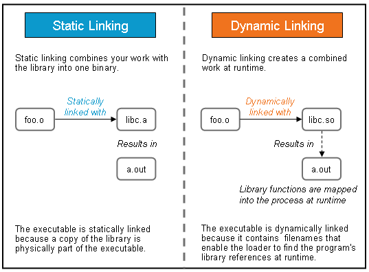

### Library

definition:

> A library is a collection of pre-compiled pieces of code called **functions**. The library contains common functions and together, they form a package called — a **library**. Functions are blocks of code that get reused throughout the program. Using the pieces of code again in a program saves time. It keeps the programmer from rewriting the code several times. For programmers, libraries provide reusable functions, data structures, classes and so forth.


#### Differences between Dynamic and Static Lib

https://medium.com/swlh/linux-basics-static-libraries-vs-dynamic-libraries-a7bcf8157779

https://medium.com/@StueyGK/static-libraries-vs-dynamic-libraries-af78f0b5f1e4

> *Dynamic or shared libraries occur as separate files outside of the executable files. Thus, it only needs one copy of the library’s files at runtime. At compile time, static libraries stay locked into a program. It contains the file’s programs holding a copy of the library’s files at compile time.*




When using a **dynamic library**, the programmer is referencing that library when it needs to at runtime(dynamically). It will find the program’s library reference at runtime because of the `dynamic loader`. It then loads that string length function into memory. Thus, the dynamic library accessibility must be readily available or it becomes powerless.

##### Dynamic Loader

```
/lib64/ld-linux-x86-64.so.2 is the dynamic loader in x86-64 machine 
```

It finds the dynamic libs with two files: `/etc/ld.so.conf`, `/etc/ld.so.cahe`

> d.so.conf 文件包含一个所有目录（/lib 和 /usr/lib 除外，它们会自动包含在其中）的清单，动态装入器将在其中查找共享库。
> 但是在动态装入器能“看到”这一信息之前，必须将它转换到 ld.so.cache 文件中。可以通过运行 ldconfig 命令做到这一点，当 ldconfig 操作结束时，您会有一个最新的 /etc/ld.so.cache 文件，它反映您对 /etc/ld.so.conf 所做的更改。从这一刻起，动态装入器在寻找共享库时会查看您在 /etc/ld.so.conf 中指定的所有新目录。


**LD_LIBRARY_PATH**

>**LD_LIBRARY_PATH**
>　　要指示动态装入器首先检查某个目录，请将 LD_LIBRARY_PATH 变量设置成您希望搜索的目录。多个路径之间用冒号分隔；例如：
>　　$ export LD_LIBRARY_PATH=”/usr/lib/old:/opt/lib”
>　　导出 LD_LIBRARY_PATH 后，如有可能，所有从当前 shell 启动的可执行程序都将使用 /usr/lib/old 或 /opt/lib 中的库，如果仍不能满足一些共享库相关性要求，则转回到 /etc/ld.so.conf 中指定的库。


```bash
#use ldd command to check whether or not a dynamic lib losses linkages.
ldd $shared_lib_name
```


##### Ad and Dad of Dynamic Lib

1. It only needs one copy at runtime. It is dependent on the application and the library being closely available to each other.
2. Multiple running applications use the same library without the need of each file having its own copy.
3. *However, what if the dynamic library becomes corrupt?* The executable file may not work because it lives outside of the executable and is vulnerable to breaking.
4. They hold smaller files.
5. Dynamic libraries are linked at run-time. It does not require recompilation and relinking when the programmer makes a change.

At compile time, applications utilize **static libraries**. All the copies of the functions get placed into the application file because they are needed to run the process.

##### Ad and Dad of Static Libraries

1. Static libraries resist vulnerability because it lives inside the executable file.
2. The speed at run-time occurs faster because its object code (binary) is in the executable file. Thus, calls made to the functions get executed quicker. Remember, the dynamic library lives outside of the executable, so calls would be made from the outside of the executable.
3. Changes made to the files and program require relinking and recompilation.
4. File size is much larger.

