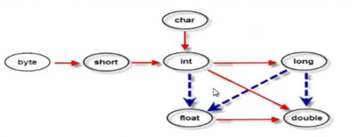

## Java 学习笔记

### 一、基础

#### 运算符

逻辑运算符：&和&&都能表示逻辑与，但是&&是短路运算，即之前的表达式如果能确定整个表达式的逻辑值，就会停止后面的运算以提高效率。

位运算符：&既能表示逻辑运算，也能表示位运算

字符串连接符：3+"4" = "34"

优先级：逻辑非>逻辑与>逻辑或+


#### 基本数据类型

| 序号 | 位数 | 默认值 | 数据类型        | 取值范围                | 举例说明          |
| ---- | ---- | ------ | --------------- | ----------------------- | ----------------- |
| 1    | 8    | 0      | byte(位)        | -2^7 - 2^7-1            | byte b = 10;      |
| 2    | 16   | 0      | short(短整数)   | -2^15 - 2^15-1          | short s = 10;     |
| 3    | 32   | 0      | int(整数)       | -2^31 - 2^31-1          | int i = 10;       |
| 4    | 64   | 0      | long(长整数)    | -2^63 - 2^63-1          | long l = 10l;     |
| 5    | 32   | 0.0    | float(单精度)   | -3.40E+38 ~ +3.40E+38   | float f = 10.0f;  |
| 6    | 64   | 0.0    | double(双精度)  | -1.79E+308 ~ +1.79E+308 | double d = 10.0d; |
| 7    | 16   | 空     | char(字符)      | 0 - 2^16-1              | char c = 'c';     |
| 8    | 8    | false  | boolean(布尔值) | true、false             | boolean b = true; |

##### 自动类型转换

自动类型转换指的是**容量小**的数据类型可以自动转换为**容量大**的数据类型（注意不是字节大小，而是容量大小）



*实线表示无数据丢失的自动类型转换，虚线表示在转换时可能有精度上的损失。

*可以将整型常量直接赋值给byte、short、char等类型变量，而不需要进行强制类型转换，只要不超出其表数范围即可。

```java
short b = 12;			//合法
short b = 1234567;		//非法
```

##### 强制类型转换

又称造型。有可能丢失信息的情况下进行的转换是通过造型来完成的，但可能造成精度降低或溢出。

```java
int a = 100000000;
int b = 20;
int total = a*b ;			//溢出
Long total2 = a*b;			//溢出，存储a*b的临时变量还是int
Long total3 = a*(Long)b;		//合法

//可以通过提前改变变量的类型来确保正确性
```


#### 控制语句

带标签的break和continue

```java
outer:for(int i=101; i<150;++i){
    for(int j = 2;j< i/2;++j){
        if(i %j == 0){
			continue outer;
        }
    }
    System.out.println("质数:"+i);
}
```

### 二、面向对象

类：抽象的概念，不是具体存在的东西，对象的模板，静态的概念

对象：类的具体，实际存在的东西，动态的概念

引用类型：数组、对象、接口

#### 内存分析

Java虚拟机的内存可分为三个区域：栈stack、堆heap、方法区method area、程序计数器、本地方法栈(Native Method Stack)

**栈**：

1. 描述的是**方法执行的内存模型**，每个方法被调用都会创建一个栈帧（存储局部变量、操作数、方法出口等）
2. 局部变量表中存放了编译期间可知的各种基本数据类型和引用对象（maybe一个指向对象起始地址的引用指针），float和double占两个局部变量空间，其余只占一个。
3. JVM为**每个线程**创建一个栈，用于存放该线程执行方法的信息（实参、局部变量等），栈属于**线程私有**，不能实现线程间共享。
4. FILO先进后出
5. 由系统自动分配，**速度快**！栈是一个**连续**的内存空间。
6. 线程请求深度大于虚拟机栈所允许的深度，将抛出StackOverflowError；若虚拟机栈动态扩展时无法申请到足够的内存就会抛出OutOfMemoryError异常。

**堆**：

1. 堆用于存储创建好的**对象和数组**（数组也是对象）。
2. JVM只有一个堆，被**所有线程共享**。
3. 堆是一个不连续的内存空间，分配灵活，**速度慢**。

**方法区**（静态区）：

1. JVM只有一个方法区，被**所有线程共享**。
2. 方法区实际也是堆，只是用于存储类、常量相关的信息
3. 用来存放程序中永远不变或唯一的内容（代码、类信息、静态变量、字符串常量）

**本地方法栈**：

执行本地方法的栈，其他与虚拟机栈很相似

**程序计数器**：

可视作行号指示器。分支、跳转、循环、异常处理、线程恢复等都要依赖这个计数器来完成。多线程执行时，在任何一个确定时刻，一个处理器只会执行一个线程中的指令。为了线程切换后能恢复到正确的执行位置，每个线程都需要一个独立的计数器。java方法记录的是虚拟机字节码指令的地址。

总结：

其中程序计数器、虚拟机栈、本地方法栈是每个线程私有的内存空间，随线程而生，随线程而亡。例如栈中每一个栈帧中分配多少内存基本上在类结构确定是哪个时就已知了，因此这3个区域的内存分配和回收都是确定的，无需考虑内存回收的问题。

但方法区和堆就不同了，一个接口的多个实现类需要的内存可能不一样，我们只有在程序运行期间才会知道会创建哪些对象，这部分内存的分配和回收都是动态的，GC主要关注的是这部分内存。


#### 构造器

要点：

1. 要通过new 调用
2. 返回值为本类对象，但是不能定义返回值类型，不能在构造器中使用return返回某个值
3. 如果没有定义构造器，编译器自动定义一个无参的构造函数。如果已定义则编译器不会添加
4. 构造器名字必须和类名一致
5. 构造方法的**第一句总是super()**

创建一个对象的过程：

1. 分配对象空间，并将对象成员变量初始化为0或空
2. 执行属性值的显式初始化
3. 执行构造方法
4. 返回对象的地址给相关的变量

#### 垃圾回收机制

garbage collection

对象空间的释放：将对象赋值null即可。垃圾回收器将负责回收所有“不可达”对象的内存空间。

##### 1. 回收过程

1. 发现无用对象
2. 回收无用对象占用的内存空间

*无用对象：没有任何变量引用该对象

##### 2. 判断算法

需要有一种算法帮助判断哪些对象需要被回收

1. 引用计数器：每个对象都设一个引用计数，被引用一次，计数+1。

   - 优点：算法简单

   - 缺点：”循环引用的无用对象“无法识别

   - ```java
     Student s1 = new Student()；
     Student s2 = new Student()；
     
     s1.friend = s2;
     s2.friend = s1;
     
     s1 = null;
     s2 = null;
     //此时s1和s2引用计数不为0，但实际已经无用，但无法被识别
     ```

2. 引用可达法（根搜索算法）

   - 通过一系列的称为 "GC Roots" 的对象作为起始点，从这些节点开始向下搜索，搜索所走过的路径称为引用链（Reference Chain），当一个对象到 GC Roots 没有任何引用链相连时，则证明此对象是不可用的。此算法解决了上述循环引用的问题。

   

在Java语言中，可作为 **GC Roots** 的对象包括下面几种：

a. 虚拟机栈（栈帧中的本地变量表）中引用的对象。

b. 方法区中类静态属性引用的对象。

c. 方法区中常量引用的对象。

d. 本地方法栈中 JNI（Native方法）引用的对象


不可达的对象将暂时处于“缓刑”阶段，要真正宣告一个对象死亡，至少要经历两次标记过程：

1. 如果对象在进行可达性分析后发现**没有与 GC Roots 相连接的引用链**，那它将会被第一次标记并且进行一次筛选，筛选的条件是此对象是否有必要执行 `finalize()` 方法。
2. 当对象没有覆盖 `finalize()` 方法，或者 `finalize()` 方法已经被虚拟机调用过，虚拟机将这两种情况都视为“没有必要执行”，直接进行第二次标记。
3. 如果这个对象被判定为有必要执行 `finalize()` 方法，那么这个对象将会放置在一个叫做 F-Queue 的队列之中，并在稍后由一个由虚拟机自动建立的、低优先级的 Finalizer 线程去执行它。

这里所谓的“执行”是指虚拟机会触发这个方法，但并不承诺会等待它运行结束，因为如果一个对象在 `finalize()` 方法中执行缓慢，将很可能会一直阻塞 F-Queue 队列，甚至导致整个内存回收系统崩溃。


#### 垃圾收集算法

一共有 4 种：

1. 标记-清除算法
2. 复制算法
3. 标记整理算法
4. 分代收集算法

##### 1. 标记-清除算法

最基础的收集算法是“标记-清除”（Mark-Sweep）算法，分为“标记”和“清除”两个阶段：首先标记出所有需要回收的对象，在标记完成后统一回收所有被标记的对象。

它的主要不足有两个：

1. 效率问题，标记和清除两个过程的效率都不高；
2. 空间问题，标记清除之后会产生大量不连续的内存碎片，空间碎片太多可能会导致以后在程序运行过程中需要分配较大对象时，无法找到足够的连续内存而不得不提前触发另一次垃圾收集动作。

过程：


##### 2. 复制算法

为了解决效率问题，一种称为“复制”（Copying）的收集算法出现了，它将可用内存按容量划分为大小相等的两块，每次只使用其中的一块。当这一块的内存用完了，就将还存活着的对象复制到另外一块上面，然后再把已使用过的内存空间一次清理掉。

这样使得每次都是对整个半区进行内存回收，内存分配时也就不用考虑内存碎片等复杂情况，只要移动堆顶指针，按顺序分配内存即可，实现简单，运行高效。只是这种算法的代价是将内存缩小为了原来的一半。复制算法的执行过程如下图：


现在的商业虚拟机都采用这种算法来回收**新生代**，IBM 研究指出新生代中的对象 98% 是“朝生夕死”的，所以并不需要按照 1:1 的比例来划分内存空间，而是将内存分为一块较大的 Eden 空间和两块较小的 Survivor 空间，每次使用 Eden 和其中一块 Survivor 。

当回收时，将 Eden 和 Survivor 中还存活着的对象一次性地复制到另外一块 Survivor 空间上，最后清理掉 Eden 和刚才用过的 Survivor 空间。HotSpot 虚拟机默认 Eden:Survivor = 8:1，也就是每次新生代中可用内存空间为整个新生代容量的 90%（其中一块Survivor不可用），只有10%的内存会被“浪费”。

当然，98%的对象可回收只是一般场景下的数据，我们没有办法保证每次回收都只有不多于 10% 的对象存活，当 Survivor 空间不够用时，需要依赖其他内存（这里指老年代）进行分配担保（Handle Promotion）。

内存的分配担保就好比我们去银行借款，如果我们信誉很好，在 98% 的情况下都能按时偿还，于是银行可能会默认我们下一次也能按时按量地偿还贷款，只需要有一个担保人能保证如果我不能还款时，可以从他的账户扣钱，那银行就认为没有风险了。

内存的分配担保也一样，如果另外一块 Survivor 空间没有足够空间存放上一次新生代收集下来的存活对象时，这些对象将直接通过分配担保机制进入老年代。

##### 3. 标记整理算法

复制算法在对象存活率较高时就要进行较多的复制操作，效率将会变低。更关键的是，如果不想浪费 50% 的空间，就需要有额外的空间进行分配担保，以应对被使用的内存中所有对象都 100% 存活的极端情况，所以在老年代一般不能直接选用这种算法。

根据老年代的特点，有人提出了另外一种“标记-整理”（Mark-Compact）算法，标记过程仍然与“标记-清除”算法一样，但后续步骤不是直接对可回收对象进行清理，而是让所有存活的对象都向一端移动，然后**直接清理掉端边界以外的内存**，“标记-整理”算法的示意图如下：


##### 4. 分代收集算法

当前商业虚拟机的垃圾收集都采用“分代收集”（Generational Collection）算法，根据对象存活周期的不同将内存划分为几块并采用不用的垃圾收集算法。

一般是把 Java 堆分为新生代和老年代，这样就可以根据各个年代的特点采用最适当的收集算法。在新生代中，每次垃圾收集时都发现有大批对象死去，只有少量存活，那就选用**复制算法**，只需要付出少量存活对象的复制成本就可以完成收集。而老年代中因为对象存活率高、没有额外空间对它进行分配担保，就必须使用“**标记—清理”或者“标记—整理”**算法来进行回收。


##### this

常用用法：

1. 产生二义性时指明当前对象
2. 调用重载的构造方法，避免相同的初始化代码，只能在构造方法中用，并且必须位于构造方法的第一句

构造器中调用另一构造器

```java
A(int a, int b){
    this.a = a;
    this.b = b;
}

A(int a,int b,int c){
    this(a,b);				//this调用另一构造器
    this.c = c;
}
```

3. this**不能**用于static方法中。

##### static

类变量的生命周期和类相同，在整个应用程序执行期间都有效。

static 需放在方法的类型前面

##### 静态初始化块

用于类的初始化操作，不可使用this关键字，不能访问属于实例的属性和方法。在继承关系中，先调用父类的静态初始化块。

```java
public class Son extends Father {
    static int sNum = 0;
    int num = 0;
    public static void main(String[] args){
        System.out.println("-----");
        new Father();
        System.out.println("-----");
        new Son();
        System.out.println("-----");
        System.out.println("sNum = " + sNum);
    }
    
    public Son() {
        System.out.println("Son构造方法");
    }
    
    static {
        //num = 1;    //报错：无法为非静态变量赋值
        sNum = 1;
        System.out.println("Son静态初始化器");
    }
}
```

#### 包

一定是非注释性语句的第一句

java.lang包不用导入

```java
import java.util.*;				//导入该包下所有类，会降低编译速度，但不降低运行速度

import static java.lang.Math.*;			//导入Math类下所有静态属性
import static java.lang.Math.PI;		//导入Math下的静态属性PI

//之后便可直接使用，不需要加类名

System.out.println(PI);
```

#### 继承

1. 子类继承父类，可以得到父类的全部属性和方法（除了父类的构造方法）
2. 没有调用extends方法则它的父类是：java.lang.Object

##### 1. 重写

需要符合的要求：

1. 方法名、形参列表**相同**
2. 返回值类型、声明异常类型，子类**小于等于**父类
3. 访问权限子类**大于等于**父类

小于是指继承关系中在下层

##### 2. Object类

所有java类的根基类，所有java对象都有Object类的属性和方法！

toString()：System.out.println等输出时调用的方法

==：比较双方是否相同。若是基本类型则需值相等；引用类型则需地址相同

equals：Object类中提供的方法，判断对象内容是否相同

##### 3. super

可通过super访问父类中被子类覆盖的方法或属性

构造方法的第一句总是默认super(...)调用父类的构造方法，写与不写都是这样

##### 4. 优先级

在继承链中对象方法的调用存在一个优先级：this.show(O)、super.show(O)、this.show((super)O)、super.show((super)O)。


#### 封装

访问权限

| 修饰符    | 同一个类 | 同一个包 | 子类 | 所有类 |
| --------- | -------- | -------- | ---- | ------ |
| private   | *        |          |      |        |
| default   | *        | *        |      |        |
| protected | *        | *        | *    |        |
| public    | *        | *        | *    | *      |

#### 多态

1. 多态是方法的多态
2. 多态的存在必须有三个必要条件：继承、方法重写、父类引用指向子类对象
3. 父类引用指向子类对象后，用该父类引用调用子类重写的方法，就出现多态。

强制向下转型

```java
Animal d = new Dog();			//此时d不能调用Dog中新写的方法，只能调用Animal类中的方法

Dog d2 = (Dog)d;
```

##### final

可修饰

变量：被修饰的变量不可修改，被赋了初值之后就不能被重新赋值

方法：**不可被子类重写**，但可以被重载

类：修饰的类不能被继承。如Math、String等


#### 数组

数组变量属于**引用类型**，数组可看成对象，每个元素看作成员。

默认初始化

```java
//基础数据类型
int [] str = new int[10];
```

静态初始化

```java
int []a = {2,4,6};
User []b = {
    new User(1001,"aa");
    new User(1002,"bb");
}
```

动态初始化

```java
//引用数据类型
User []mans = new User[2];
mans[0] = new User("...");
mans[1] = new User("...");
```

for each遍历：用于读取数组元素的值，不能修改元素的值

```java
for(int m : a){
    //print
}
```


#### 抽象类

抽象方法：使用abstract定义的方法，没有方法体，只有声明。

抽象类：包含抽象方法的类。通过abstract定义。限制子类的实现，子类继承之后必须实现这些抽象方法。不能new创建对象

#### 接口

接口中只有：抽象方法。接口完全面向规范。

接口和实现类不是父子关系，是实现规则的关系。

定义的详细说明：

1. 接口中的访问修饰符只能是public或默认
2. extends：接口可以多继承
3. 常量：接口中的属性只能是常量，总是**public static final**修饰
4. 方法：只能是public abstract。省略的话，也是**public abstract**

Gist:

1. 子类通过implements来实现接口中的规范
2. 接口不能创建实例，但可用于声明引用变量类型
3. 子类继承接口后，必须实现所有方法
4. JDK1.8后，接口中包含普通的静态方法

#### 内部类

内部类主要分为：成员内部类（静态内部类、非静态内部类）、匿名内部类、局部内部类

##### 1. 非静态内部类

```java
class Outer{
    private int age = 10;
    
    class Inner{
        int age =20 ; 
        System.out.println("外部类的成员："+Outer.this.age);
        System.out.println("内部类的成员："+this.age);
    }
}

public static void main(){
    //创建内部类对象 依托于外部类对象
    Outer.Inner inner = new Outer().new Inner();
	
    inner.show();
}
```

Gist:

1. 表示方法为Outer&Inner
2. 一个非静态内部类对象一定存在一个对应的外部类对象，相当于类的成员
3. 非静态内部类对象可以直接访问外部类成员，但是外部类成员**不能直接**访问内部类成员
4. 非静态内部类**不能**有静态方法、静态属性和静态初始化块
5. 外部类的静态方法、静态代码块不能访问非晶态内部类

访问要点：

1. 内部类属性：this.变量名
2. 外部类属性：外部类名.this.变量名

##### 2. 静态内部类

Gist：

1. 当一个静态内部类存在时，并不一定存在一个对应的外部类对象，因此静态内部类的实例方法不能直接访问外部类的实例方法
2. 静态内部类可以看作外部类的一个静态成员。因此，外部类的方法中可以通过：“静态内部类.名字”的方法访问其静态成员，通过new 静态内部类()访问静态内部类的实例。

```java
class Outer{
    static class Inner{
    	    
    } 
}

public static void main(){
    //创建对象
    Outer.Inner inner = new Outer.Inner();
}
```

##### 3. 匿名内部类

适合那种只需要使用一次的类

```java
public void test(A a){
    a.call();
}

interface A{
    void call();
}

public static void main(){
    test(new A(){
        
        @Override
        public void call(){
            System.out.println("实现了匿名内部类");
        }
    });
}
```


### 三、常用类

#### 1. Array

提供静态工厂

```java
int [] a = {1,3,2,6,5,4};

a.toString()：			//静态方法，和Object的方法不同

Arrays.sort(a);			//排序，对自定义的类若需要自定义排序规则，该类要implements Comparable接口

Arrays.binarySearch(a,12);		//二分查找，返回索引位置, -1表示不存在

```

多维数组：

```java
//多维数组的声明和初始化应从低维到高维
int [][]a = new int[3][];
a[0] = new int[]{20,30};
a[1] = new int [3];
a[2] = new int [4];

//int a1[][] = new int [][4];		非法！

//静态初始化
int [][]b = {
    {20,30,40},
    {50,20},
    {100,200,300}
};
```


#### 2. String

常量池的概念	，不可变字符串序列

```java
String str1 = "xwl";
String str2 = "xwl";				// str1==str2
String str3 = new String("xwl");		//str1 != str3

//"xwl"被放入字符串常量池中
//str3 则是新建了一个字符串对象
```

通常使用equals比较字符串是否相等

##### StringBuilder/Buffer

String对象的字符序列是不可以被修改的

和 String 类不同的是，StringBuffer 和 StringBuilder 类的对象能够被多次的修改，并且不产生新的未使用对象。

StringBuilder 类在 Java 5 中被提出，它和 StringBuffer 之间的最大不同在于 StringBuilder 的方法不是线程安全的（不能同步访问）。

由于 StringBuilder 相较于 StringBuffer 有速度优势，所以多数情况下建议使用 StringBuilder 类。然而在应用程序要求线程安全的情况下，则必须使用 StringBuffer 类。

```java
StringBuilder sb = new StringBuilder();
//初始化
sb.reverse();			//逆序
sb.setCharAt(3,'d');		//修改
sb.insert(0,'a');			//在index位置插入, 返沪值为this

sb.delete(20,23);		//删除在 [start,end) 区间中的值
```

不可变字符串序列使用**陷阱!**

```java
String str = "";
for(int i=0;i<5000;++i){
    str = str + i;
}
//相当于产生10000个对象


//应该使用这种方式
for(int i=0;i<5000;++i){
    str.append(i);
}
```

#### 3. Date

用long类型的变量来表示时间

```java
long now = System.currentTimeMillis();

Date d = new Date();			//什么都不传默认当前时刻
Date d = new Date(2000);			//	1970/1/1 0:00:00 + 2000毫秒
```

遇到日期，使用Calendar类.

##### DateFormat

完成字符串和时间对象的转化，抽象类

```java
DateFormat df = new SimpleDateFormat("yyyy-MM-dd hh:mm:ss");//使用子类创建
//DateFormat df = new SimpleDateFormat("yyyy-MM-dd");

//format方法将Date转为指定格式的字符串
String str = df.format(new Date (4000000));

//parse方法将指定格式的字符串转成Date
Date df2 = new SimpleDateFormat("yyyy年MM月dd日 hh时mm分ss秒");
Date date = df2.parse("2010年10月10日 21时43分28秒");

//其他格式
//大D 表示返回今天是本年的第几天
Date df3 = new SimpleDateFormat("D");
String str3 = df3.format(new Date());
```


##### Calendar

抽象类，提供关于日期计算的相关功能.

```java
//使用 年 月 日
Calendar calendar = new GregorianCalendar(2019, 9,9,23, 50 50);
int year = calendar.get(Calendar.YEAR);
int month = calendar.get(Calendar.MONTH);
int weekday = calendar.get(Calendar.DAY_OF_WEEK);


calendar.set(Calendar.YEAR, 2020);	//设置指定项的数值
calendar.add(Calendar.DATE, 100);			//增加100天

Date d = calendar.getTime();
calendar.setTime(new Date());
```


#### 4. File

```java
File file = new File("D:/a.txt");

//文件重命名
file.renameTo(new File("D/b.txt"));

//打印项目目录路径
System.out.println(System.getProperty("user.dir"));

File f2 = new File("g.cpp");
f2.createNewFile();
```

若不加路径直接new，则默认在类路径下创建

mkdirs可在没有父文件夹的时候创建

mkdir则不行

#### 5. 枚举

```java
enum Season{
    SPRING, SUMMER, AUTUMN, WINTER
}
```


#### 6. 异常

抛出异常：执行方法时，如果发生异常，方法生成一个异常对象，把异常抛给JRE

捕获异常：JRE得到异常后，JRE在方法的调用栈中查找，从生成异常的地方回溯，直到找到相应的异常处理代码为止。

RunTimeException JRE会接收，不用自己编写catch

而Exception 需要自己往外抛，或者方法内catch

*异常往往在高层处理

可分类catch

```java
try{
    //...
}catch(SonException e){			//子类异常在父类异常之前
    
}catch(Exception e){
    
}
```

#### 7. 包装类

包装类（Wrapper Class）。基本数据类型不是对象，但有时需要把其转成对象。

| 基本数据类型 | 包装类    |
| ------------ | --------- |
| byte         | Byte      |
| boolean      | Boolean   |
| short        | Short     |
| char         | Character |
| int          | Integer   |
| long         | Long      |
| float        | Float     |
| double       | Double    |

Integer：

```java
Integer i = new Integer(10);
Integer j = new Integer(50);
```

内存：


使用方法：

```java
//基本类型转Integer对象
Integer int1 = new Integer(10);
Integer int2 = Integer.valueOf(20);			//官方推荐

int a = int1.intValue();
double d = int2.doubleValue();

Integer int3 = new Integer("334");
Integer int4 = Integer.parseInt("999");

String str1 = int3.toString();
```

##### 自动装箱和拆箱

编译器自动处理

```java
Integer a = 234;		//自动装箱：Integer a = Integer.valueOf(234);

int b = a;				//自动拆箱：int b = a.intValue();
```

缓存问题：

Integer包装类中缓存[-128,127]的值。在系统初始的时候，创建了[-128,127]之间的一个缓存数组，当我们调用valueOf()的时候，首先检查是否在[-128,127]之间，如果在这个范围内直接从缓存中取，否则在堆里new一个包装类对象。

```java
Integer int1 = -128;
Integer int2 = -128;
sout(int1 == int2);				//true

Integer int3 = 1234;
Integer int4 = 1234;
sout(int3 == int4);				//false
```


### 四、容器


#### *泛型

帮助建立类型安全的集合。泛型本质是”数据类型的参数化“。使用占位符表示数据类型，告诉编译器在调用泛型时必须传入实际类型。

```java
class MyCollection<E> {				//E表示泛型
    Object []objs = new Object[5];
    
    public E get(int index){
        return (E) objs[index];
    }
    
    public void set(E e, int index){
        objs[index] = e;
    }
}
```

若创建对象时不传类型参数，则类型都默认为Object


#### 1. List

##### ArrayList

基于数组实现；插入删除数据慢；初始化时构建空数组；可以sort

　　1）如果是第一次添加元素，数组的长度被扩容到默认的capacity，也就是10.

　　2）当发觉同时添加一个或者是多个元素，数组长度不够时，就扩容，这里有两种情况：

　　只添加一个元素，例如：原来数组的capacity为10，size已经为10，不能再添加了。需要扩容，新的capacity=old capacity+old capacity>>1=10+10/2=15。即新的容量为15。

　　当同时添加多个元素时，原来数组的capacity为10，size为10，当同时添加6个元素时。它需要的min capacity为16，而按照capacity=old capacity+old capacity>>1=10+10/2=15。new capacity小于min capacity，则取min capacity。

JDK1.8源码：

```java
private static final int MAX_ARRAY_SIZE = Integer.MAX_VALUE - 8;		//容量上限

private static final int DEFAULT_CAPACITY = 10;					//第一次默认阔扩展的值


private static int calculateCapacity(Object[] elementData, int minCapacity) {
    //如果此时容器为空，则取minC和10的较大值    
    if (elementData == DEFAULTCAPACITY_EMPTY_ELEMENTDATA) {
            return Math.max(DEFAULT_CAPACITY, minCapacity);
        }
        return minCapacity;
}
	
//所有增加成员的方法都要执行的方法
    private void ensureCapacityInternal(int minCapacity) {
        ensureExplicitCapacity(calculateCapacity(elementData, minCapacity));
    }

    private void ensureExplicitCapacity(int minCapacity) {
        //记录修改次数
        modCount++;

        // overflow-conscious code
        if (minCapacity - elementData.length > 0)
            grow(minCapacity);
    }


/**
	minCapacity:当前容器需要的最小容量
*/
private void grow(int minCapacity) {
    // overflow-conscious code
    int oldCapacity = elementData.length;
    int newCapacity = oldCapacity + (oldCapacity >> 1);		//扩展为1.5倍
    //若扩展后仍<minCapacity，则取minCapacity
    if (newCapacity - minCapacity < 0)						
        newCapacity = minCapacity;
    if (newCapacity - MAX_ARRAY_SIZE > 0)
        newCapacity = hugeCapacity(minCapacity);
    
    // minCapacity is usually close to size, so this is a win:
    elementData = Arrays.copyOf(elementData, newCapacity);			//复制到扩展后的数组上
}

private static int hugeCapacity(int minCapacity) {
        if (minCapacity < 0) // overflow
            throw new OutOfMemoryError();
        return (minCapacity > MAX_ARRAY_SIZE) ?
            Integer.MAX_VALUE :
            MAX_ARRAY_SIZE;
    }

```


##### LinkedList

基于双向链表，按照插入顺序排列；不可sort

头部插入和尾部插入复杂度为O(1)；

删除：根据给定的下标index，判断它first节点、last直接距离，如果index<size（数组元素个数)/2,就从first开始。如果大于，就从last开始。

源码：

```java
	//头插	
private void linkFirst(E e) {
        final Node<E> f = first;
        final Node<E> newNode = new Node<>(null, e, f);
        first = newNode;
        if (f == null)
            last = newNode;
        else
            f.prev = newNode;
        size++;
        modCount++;
    }

	//尾插
    void linkLast(E e) {
        final Node<E> l = last;
        final Node<E> newNode = new Node<>(l, e, null);
        last = newNode;
        if (l == null)
            first = newNode;
        else
            l.next = newNode;
        size++;
        modCount++;
    }

//删除f节点
 private E unlinkFirst(Node<E> f) {
        // assert f == first && f != null;
        final E element = f.item;
        final Node<E> next = f.next;
        f.item = null;
        f.next = null; // help GC
        first = next;
        if (next == null)
            last = null;
        else
            next.prev = null;
        size--;
        modCount++;
        return element;
    }

//根据下表获取， 除2优化
Node<E> node(int index) {
        // assert isElementIndex(index);

        if (index < (size >> 1)) {
            Node<E> x = first;
            for (int i = 0; i < index; i++)
                x = x.next;
            return x;
        } else {
            Node<E> x = last;
            for (int i = size - 1; i > index; i--)
                x = x.prev;
            return x;
        }
    }
```


#### 2. Set

##### HashSet 

无序，不重复，没有索引。

基于HashMap来实现的，只使用了HashMap的key来实现各种特性，而HashMap的value始终都是一个PRESENT对象。

HashSet不允许重复（HashMap的key不允许重复，如果出现重复就覆盖），允许null值，**非线程安全**。默认初始容量是 16，加载因子是 0.75。构造函数可指定初始容量和加载因子。

```java
//底层用HashMap实现
private transient HashMap<E,Object> map;

//默认的value
private static final Object PRESENT = new Object();
```

数组去重：

```java
 public static Object[] oneClear(Object[] arr){
  Set set = new HashSet();
  for(int i=0;i<arr.length;i++){
  　 set.add(arr[i]);
  　}
  return set.toArray();
 }
```

##### TreeSet

底层使用TreeMap实现，内部维持了一个简化版的TreeMap

##### LinkedHashSet

非线程安全！

保持数组有序的情况下去重

```java
public static Object[] twoClear(Object[] arr){
  LinkedHashSet<Object> temp = new LinkedHashSet<>();
  for(int i=0;i<arr.length;i++){
   　　temp.add(arr[i]);
  　}
  return temp.toArray();
 }
```


#### 3. Map

##### HashMap

键值对，键不能重复，值可以重复。键重复的话，第一次的值会被第二次的值覆盖。底层采用了哈希表。基本结构为数组+链表。

哈希：

作为键的类重写了hashCode方法，返回一个哈希数，根据这个数值确定自己的index.

```java
//取余的快速算法
hash = hash & (length - 1); 
```

**JDK1.8**后，单个桶的长度大于8后，转换为红黑树。当数量小于6后，就把红黑树变回链表。

查找：通过hash值找到index后，对链表中元素的key按次序equals匹配，直至找到。Java中规定，两个内容相同的对象（即equals为true）必须具有相同的hashCode。

扩容：初始大小为16。如果位桶数组中的元素达到(0.75*数组length)，就重新调整数组大小为原来2倍

单个桶的结构：


表的结构：


源码：

```java
static final int DEFAULT_INITIAL_CAPACITY = 1 << 4; // aka 16

static final int MAXIMUM_CAPACITY = 1 << 30;

static final float DEFAULT_LOAD_FACTOR = 0.75f;

//计算表内哈希地址
static final int hash(Object key) {
        int h;
        return (key == null) ? 0 : (h = key.hashCode()) ^ (h >>> 16);
}
```

HashMap中，null可以作为键，这样的键只有一个；可以有一个或多个键所对应的值为null。当get()方法返回null值时，可能是 HashMap中没有该键，也可能使该键所对应的值为null。因此，在HashMap中不能由get()方法来判断HashMap中是否存在某个键， 而应该用containsKey()方法来判断。

##### TreeMap

红黑树的典型实现。效率比HashMap低，一般排序的时候才使用。

若果要对自定义类进行排序，则该类需要实现Comparable接口。

##### HashMap多线程问题

线程不安全；可能造成死锁

```java
复制代码
 public V put(K key, V value) {
        if (key == null)
            return putForNullKey(value);
        int hash = hash(key.hashCode());
        int i = indexFor(hash, table.length);
        for (Entry<K,V> e = table[i]; e != null; e = e.next) { 	//374行处会导致死锁
            Object k;
            if (e.hash == hash && ((k = e.key) == key || key.equals(k))) {
                V oldValue = e.value;
                e.value = value;
                e.recordAccess(this);
                return oldValue;
            }
        }

        modCount++;
        addEntry(hash, key, value, i);
        return null;
    }
```

①互斥条件：链表上的节点同一时间此时被两个线程占用，两个线程占用访问节点的权利，符合该条件

②请求和保持条件：Thread1保持着节点e1，又提出了占用节点e2(此时尚未释放e2)；而Thread2此时占用e2,又提出了占用节点e1，Thread1占用着Thread2接下来要用的e1,而Thread2又占用着Thread1接下来要用的e2，符合该条件

③：不剥夺条件：线程是由自己的退出的，此时并没有任何中断机制（sleep或者wait方法或者interuppted中断），只能由自己释放，满足条件

④：环路等待条件：e1、e2、e3等形成了资源的环形链条，满足该条件


如果存在线程1和线程2，在rehash之前中，a、b、c在table[1]形成了链表，a的next指向了b，这时发生了put操作，两个线程同时进行了rehash。

线程1在遍历Hash表元素中，取a.next时**被挂起**。

线程2继续完成了rehash操作，重组了链表（**头插**，为了避免遍历链表），重组结束后，b.next指向了a。

线程1继续执行，a.next又指向了b，环形链表因此产生了。

*JDK8已经解决该问题

##### HashTable

也是一个散列表。它存储的内容是键值对(key-value)映射。

继承自Dictionary，实现了Map、Cloneable、java.io.Serializable接口。

线程安全。它的key、value都不可以为null。

此外，Hashtable中的映射不是有序的。

初始容量为11；默认加载因子为0.75；超过threshould就容量*2+1。哈希的之后与完max_int模表的size。

##### HashTable和HashMap区别

1、继承的父类不同：Hashtable继承自Dictionary类，而HashMap继承自AbstractMap类。但二者都实现了Map接口。

2、线程安全性不同： Hashtable 中的方法是Synchronize的，而HashMap中的方法在缺省情况下是非Synchronize的。在多线程并发的环境下，可以直接使用Hashtable，不需要自己为它的方法实现同步，但使用HashMap时就必须要自己增加同步处理。

```java
Map m = Collections.synchronizedMap(new HashMap(...));
```

3、是否提供contains方法

HashMap把Hashtable的contains方法去掉了，改成containsValue和containsKey，因为contains方法容易让人引起误解。

4、key和value是否允许null值

Hashtable中，key和value都不允许出现null值。但是如果在Hashtable中有类似put(null,null)的操作，编译同样可以通过，因为key和value都是Object类型，但运行时会抛出NullPointerException异常。
HashMap中，null可以作为键，这样的键只有一个；可以有一个或多个键所对应的值为null。当get()方法返回null值时，可能是 HashMap中没有该键，也可能使该键所对应的值为null。因此，在HashMap中不能由get()方法来判断HashMap中是否存在某个键， 而应该用containsKey()方法来判断。

5、两个遍历方式的内部实现上不同

Hashtable、HashMap都使用了 Iterator。而由于历史原因，Hashtable还使用了Enumeration的方式 。Hashtable与HashMap另一个区别是HashMap的迭代器（Iterator）是fail-fast迭代器，而Hashtable的enumerator迭代器不是fail-fast的。所以当有其它线程改变了HashMap的结构（增加或者移除元素），将会抛出ConcurrentModificationException，但迭代器本身的remove()方法移除元素则不会抛出ConcurrentModificationException异常。但这并不是一个一定发生的行为，要看JVM。

6、hash值不同

哈希值的使用不同，HashTable直接使用对象的hashCode。而HashMap重新计算hash值。

hashCode是jdk根据对象的地址或者字符串或者数字算出来的int类型的数值。

Hashtable计算hash值，直接用key的hashCode()，而HashMap重新计算了key的hash值，Hashtable在求hash值对应的位置索引时，用取模运算，而HashMap在求位置索引时，则用与运算，且这里一般先用hash&0x7FFFFFFF后，再对length取模，&0x7FFFFFFF的目的是为了将负的hash值转化为正值，因为hash值有可能为负数，而&0x7FFFFFFF后，只有符号外改变，而后面的位都不变。

 7、内部实现使用的数组初始化和扩容方式不同

​      HashTable在不指定容量的情况下的默认容量为11，而HashMap为16，Hashtable不要求底层数组的容量一定要为2的整数次幂，而HashMap则要求一定为2的整数次幂。

​      Hashtable和HashMap它们两个内部实现方式的数组的初始大小和扩容的方式。HashTable中hash数组默认大小是11，增加的方式是 old*2+1。

##### ConcurrentHashMap

- 底层采用分段的数组+链表实现，线程**安全**
- 通过把整个Map分为N个Segment，可以提供相同的线程安全，但是效率提升N倍，默认提升16倍。(读操作不加锁，由于HashEntry的value变量是 volatile的，也能保证读取到最新的值。)
- Hashtable的synchronized是针对整张Hash表的，即每次锁住整张表让线程独占，ConcurrentHashMap允许多个修改操作并发进行，其关键在于使用了锁分离技术
- 有些方法需要跨段，比如size()和containsValue()，它们可能需要锁定整个表而而不仅仅是某个段，这需要按顺序锁定所有段，操作完毕后，又按顺序释放所有段的锁
- 扩容：段内扩容（段内元素超过该段对应Entry数组长度的75%触发扩容，不会对整个Map进行扩容），插入前检测需不需要扩容，有效避免无效扩容

ConcurrentHashMap是使用了锁分段技术来保证线程安全的。

**锁分段技术**：首先将数据分成一段一段的存储，然后给每一段数据配一把锁，当一个线程占用锁访问其中一个段数据的时候，其他段的数据也能被其他线程访问。 

ConcurrentHashMap提供了与Hashtable和SynchronizedMap不同的锁机制。Hashtable中采用的锁机制是一次锁住整个hash表，从而在同一时刻只能由一个线程对其进行操作；而ConcurrentHashMap中则是一次锁住一个桶。

ConcurrentHashMap默认将hash表分为16个桶，诸如get、put、remove等常用操作只锁住当前需要用到的桶。这样，原来只能一个线程进入，现在却能同时有16个写线程执行，并发性能的提升是显而易见的。

#### 4. 迭代器

提供了统一的遍历容器的方式。

```java
List<String> alist = new ArrayList<String>();
//初始化

for(Iterator<String> iter = aList.iterator(); iter.hasNext(); ){
    String tmp = iter.next();
    if(tmp.endWiths('3')){
        iter.remove();				//删除以3结尾的字符串
    }
}
```

##### 遍历Map

1、获取键值对集合

```java
Map<String,String> map = new HashMap<String,String>();

//初始化

Set<Entry<String,String> > ss = map.entrySet();			//获取entry集合

for(Iterator<Entry<String, String> > iterator = ss.iterator(); iterator.hasNext(); ){
    Entry<String, String> e = iterator.next();
    System.out.println(e.getKey()+" "+e.getValue());
}
```

2、获取键集合

```java
Map<Integer,String> map = new HashMap<Integer,String>();

//初始化

Set<Integer,String> ss = map.entrySet();			//获取entry集合

for(Iterator<Integer> iterator = ss.iterator(); iterator.hasNext(); ){
    Integer key = iterator.next();
  	System.out.println(key+" "+map.get(key) );
}
```


### 五、Java反射

#### 1. 规范

JAVA反射机制是在运行状态中，对于任意一个类，都能够知道这个类的所有属性和方法；对于任意一个对象，都能够调用它的任意一个方法和属性；这种动态获取的信息以及动态调用对象的方法的功能称为java语言的反射机制。

要想解剖一个类,必须先要获取到该类的字节码文件对象。虚拟机启动以后会把Class文件中的字节码加载进来。而解剖使用的就是Class类中的方法.所以先要获取到每一个字节码文件对应的Class类型的对象。

反射就是把java类中的各种成分映射成一个个的Java对象。例如：一个类有：成员变量、方法、构造方法、包等等信息，利用反射技术可以对一个类进行解剖，把个个组成部分映射成一个个对象。

如图是类的正常加载过程：反射的原理在于class对象。

熟悉一下加载的时候：**Class对象**的由来是将class文件读入内存，并为之创建一个Class对象。


#### 2. Class类

`Class` 类的实例表示正在运行的 Java 应用程序中的类和接口。也就是jvm中有N多的实例，每个类都有该Class对象。（包括基本数据类型）

`Class` 没有公共构造方法。`Class` 对象是在加载类时由 Java 虚拟机以及通过调用类加载器中的**defineClass 方法**自动构造的。也就是这不需要我们自己去处理创建，JVM已经帮我们创建好了。

#### 3. 反射的使用

##### 1. 获取Class对象的三种方式

1.1 Object ——> getClass(); 

1.2 任何数据类型（包括基本数据类型）都有一个“静态”的class属性 

1.3 通过Class类的静态方法：forName（String  className）(常用)

```java
/** 
 * 获取Class对象的三种方式 
 * 1 Object ——> getClass(); 
 * 2 任何数据类型（包括基本数据类型）都有一个“静态”的class属性 
 * 3 通过Class类的静态方法：forName（String  className）(常用) 
 */  
public class Fanshe {  
    public static void main(String[] args) {  
        //第一种方式
        Student stu1 = new Student();//这一new 产生一个Student对象，一个Class对象。  
        Class stuClass = stu1.getClass();//获取Class对象  
        System.out.println(stuClass.getName());  
          
        //第二种方式
        Class stuClass2 = Student.class;  
        System.out.println(stuClass == stuClass2);//判断第一种方式获取的Class对象和第二种方式获取的是否是同一个  
          
        //第三种方式
        try {  
            Class stuClass3 = Class.forName(”fanshe.Student”);//注意此字符串必须是真实路径，就是带包名的类路径，包名.类名  
            System.out.println(stuClass3 == stuClass2);//判断三种方式是否获取的是同一个Class对象  
        } catch (ClassNotFoundException e) {  
            e.printStackTrace();  
        }     
    }  
```

*在运行期间，一个类只有一个Class对象产生。三种方式常用第三种，第一种对象都有了还要反射干什么。第二种需要导入类的包，依赖太强，不导包就抛编译错误。一般都第三种，一个字符串可以传入也可写在配置文件中等多种方法。

##### 2. 通过反射获取构造方法

Student类：

```java
package fanshe;  
  
public class Student {  
      
    //—————构造方法——————-  
    //（默认的构造方法）  
    Student(String str){  
        System.out.println(”(默认)的构造方法 s = ” + str);  
    }  
      
    //无参构造方法  
    public Student(){  
        System.out.println(”调用了公有、无参构造方法执行了。。。”);  
    }  
      
    //有一个参数的构造方法  
    public Student(char name){  
        System.out.println(”姓名：” + name);  
    }  
      
    //有多个参数的构造方法  
    public Student(String name ,int age){  
        System.out.println(”姓名：”+name+“年龄：”+ age);//这的执行效率有问题，以后解决。  
    }  
      
    //受保护的构造方法  
    protected Student(boolean n){  
        System.out.println(”受保护的构造方法 n = ” + n);  
    }  
      
    //私有构造方法  
    private Student(int age){  
        System.out.println(”私有的构造方法   年龄：”+ age);  
    }  
}  
```

测试类：

```java
package fanshe;  
  
import java.lang.reflect.Constructor;  
/* 
 * 通过Class对象可以获取某个类中的：构造方法、成员变量、成员方法；并访问成员； 
 *  
 * 1.获取构造方法： 
 *      1).批量的方法： 
 *          public Constructor[] getConstructors()：所有”公有的”构造方法 
            public Constructor[] getDeclaredConstructors()：获取所有的构造方法(包括私有、受保护、默认、公有) 
      
 *      2).获取单个的方法，并调用： 
 *          public Constructor getConstructor(Class… parameterTypes):获取单个的”公有的”构造方法： 
 *          public Constructor getDeclaredConstructor(Class… parameterTypes):获取”某个构造方法”可以是私有的，或受保护、默认、公有； 
 *       
 *          调用构造方法： 
 *          Constructor–>newInstance(Object… initargs) 
 */  
public class Constructors {  
  
    public static void main(String[] args) throws Exception {  
        //1.加载Class对象  
        Class clazz = Class.forName(”fanshe.Student”);  
          
        //2.获取所有公有构造方法  
        System.out.println("**********************所有公有构造方法*********************************");  
        Constructor[] conArray = clazz.getConstructors();  
        for(Constructor c : conArray){  
            System.out.println(c);  
        }  
          
        System.out.println("************所有的构造方法(包括：私有、受保护、默认、公有)***************");  
        conArray = clazz.getDeclaredConstructors();  
        for(Constructor c : conArray){  
            System.out.println(c);  
        }  
          
        System.out.println("*****************获取公有、无参的构造方法*******************************");  
        Constructor con = clazz.getConstructor(null);  
        //1>、因为是无参的构造方法所以类型是一个null,不写也可以：这里需要的是一个参数的类型，切记是类型  
        //2>、返回的是描述这个无参构造函数的类对象。  
      
        System.out.println("con = ” + con");  
        //调用构造方法  
        Object obj = con.newInstance();  
          
        System.out.println("******************获取私有构造方法，并调用*******************************");  
        con = clazz.getDeclaredConstructor(char.class);  
        System.out.println(con);  
        //调用构造方法  
        con.setAccessible(true);				//暴力访问(忽略掉访问修饰符)  
        obj = con.newInstance('男');  
    }  
}  
```

**调用方法：**

1.获取构造方法：

  1).批量的方法：
public Constructor[] getConstructors()：所有”公有的”构造方法
​            public Constructor[] getDeclaredConstructors()：获取所有的构造方法(包括私有、受保护、默认、公有)

  2).获取单个的方法，并调用：
public Constructor getConstructor(Class… parameterTypes):获取单个的”公有的”构造方法：
public Constructor getDeclaredConstructor(Class… parameterTypes):获取”某个构造方法”可以是私有的，或受保护、默认、公有；

  调用构造方法：

Constructor–>newInstance(Object… initargs)


2、newInstance是 Constructor类的方法（管理构造函数的类）

api的解释为：

``newInstance(Object… initargs). 使用此 `Constructor` 对象表示的构造方法来创建该构造方法的声明类的新实例，并用指定的初始化参数初始化该实例。

它的返回值是T类型，所以newInstance是创建了一个构造方法的声明类的新实例对象，并为之调用。

##### 3. 获取成员变量

实体类：

```java
public class Student {  
    public Student(){  
          
    }  
    //**********字段*************//  
    public String name;  
    protected int age;  
    char sex;  
    private String phoneNum;  
      
    @Override  
    public String toString() {  
        return “Student [name=” + name + “, age=” + age + “, sex=” + sex  
                + ”, phoneNum=” + phoneNum + “]”;  
    }  
}
```

测试类：

```java
public class Fields {  
  
        public static void main(String[] args) throws Exception {  
            //1.获取Class对象  
            Class stuClass = Class.forName(”fanshe.field.Student”);  
            //2.获取字段  
            System.out.println("************获取所有公有的字段********************");  
            Field[] fieldArray = stuClass.getFields();  
            for(Field f : fieldArray){  
                System.out.println(f);  
            }  
            System.out.println("************获取所有的字段(包括私有、受保护、默认的)********************");  
            fieldArray = stuClass.getDeclaredFields();  
            for(Field f : fieldArray){  
                System.out.println(f);  
            }  
            System.out.println("*************获取公有字段**并调用***********************************");  
            Field f = stuClass.getField("name");  
            System.out.println(f);  
            //获取一个对象  
            Object obj = stuClass.getConstructor().newInstance();//产生Student对象–》Student stu = new Student();  
            //为字段设置值  
            f.set(obj, "刘德华");	//为Student对象中的name属性赋值–》stu.name = ”刘德华”  
            //验证  
            Student stu = (Student)obj;  
            System.out.println("验证姓名：" + stu.name);  
              
            System.out.println("**************获取私有字段****并调用********************************");  
            f = stuClass.getDeclaredField("phoneNum");  
            System.out.println(f);  
            f.setAccessible(true);//暴力反射，解除私有限定  
            f.set(obj, "18888889999");  
            System.out.println("验证电话：" + stu);  
        }  
    }
```

调用字段时：需要传递两个参数：

Object obj = stuClass.getConstructor().newInstance();//产生Student对象–》Student stu = new Student();
//为字段设置值
f.set(obj, “刘德华”);//为Student对象中的name属性赋值–》stu.name = “刘德华”

第一个参数：要传入设置的对象，第二个参数：要传入实参

##### 4. 获取成员方法

实体类：

```java
public class Student {  
    //**************成员方法***************//  
    public void show1(String s){  
        System.out.println(”调用了：公有的，String参数的show1(): s = ” + s);  
    }  
    protected void show2(){  
        System.out.println(”调用了：受保护的，无参的show2()”);  
    }  
    void show3(){  
        System.out.println(”调用了：默认的，无参的show3()”);  
    }  
    private String show4(int age){  
        System.out.println(”调用了，私有的，并且有返回值的，int参数的show4(): age = ” + age);  
        return “abcd”;  
    }  
}  
```

测试类：

```java
import java.lang.reflect.Method;  
  
/* 
 * 获取成员方法并调用： 
 *  
 * 1.批量的： 
 *      public Method[] getMethods():获取所有”公有方法”；（包含了父类的方法也包含Object类） 
 *      public Method[] getDeclaredMethods():获取所有的成员方法，包括私有的(不包括继承的) 
 * 2.获取单个的： 
 *      public Method getMethod(String name,Class<?>… parameterTypes): 
 *                  参数： 
 *                      name : 方法名； 
 *                      Class … : 形参的Class类型对象 
 *      public Method getDeclaredMethod(String name,Class<?>… parameterTypes) 
 *  
 *   调用方法： 
 *      Method –> public Object invoke(Object obj,Object… args): 
 *                  参数说明： 
 *                  obj : 要调用方法的对象； 
 *                  args:调用方式时所传递的实参； 
 
): 
 */  
public class MethodClass {  
  
    public static void main(String[] args) throws Exception {  
        //1.获取Class对象  
        Class stuClass = Class.forName(”fanshe.method.Student”);  
        //2.获取所有公有方法  
        System.out.println(”***************获取所有的”公有“方法*******************”);  
        stuClass.getMethods();  
        Method[] methodArray = stuClass.getMethods();  
        for(Method m : methodArray){  
            System.out.println(m);  
        }  
        System.out.println(”***************获取所有的方法，包括私有的*******************”);  
        methodArray = stuClass.getDeclaredMethods();  
        for(Method m : methodArray){  
            System.out.println(m);  
        }  
        System.out.println(”***************获取公有的show1()方法*******************”);  
        Method m = stuClass.getMethod(”show1”, String.class);  
        System.out.println(m);  
        //实例化一个Student对象  
        Object obj = stuClass.getConstructor().newInstance();  
        m.invoke(obj, ”刘德华”);  
          
        System.out.println(”***************获取私有的show4()方法******************”);  
        m = stuClass.getDeclaredMethod(”show4”, int.class);  
        System.out.println(m);  
        m.setAccessible(true);//解除私有限定  
        Object result = m.invoke(obj, 20);//需要两个参数，一个是要调用的对象（获取有反射），一个是实参  
        System.out.println("返回值：" + result); 
    }  
}  
```

由此可见：

m = stuClass.getDeclaredMethod(“show4”, int.class);//调用制定方法（所有包括私有的），需要传入两个参数，第一个是调用的方法名称，第二个是方法的形参类型，切记是类型。
Object result = m.invoke(obj, 20);	//需要两个参数，一个是要调用的对象（获取有反射），一个是实参
System.out.println(“返回值：” + result);

##### 5. 反射main方法

```java
public class Student {  
  
    public static void main(String[] args) {  
        System.out.println(”main方法执行了。。。”);  
    }  
}  
```

测试类：

```java
public void Main{
    public static void main(String[] args) {  
        try {  
            //1、获取Student对象的字节码  
            Class clazz = Class.forName(”fanshe.main.Student”);  
              
            //2、获取main方法  
             Method methodMain = clazz.getMethod("main", String[].class);//第一个参数：方法名称，第二个参数：方法形参的类型，  
            //3、调用main方法  
            // methodMain.invoke(null, new String[]{“a”,”b”,”c”});  
             //第一个参数，对象类型，因为方法是static静态的，所以为null可以，第二个参数是String数组，这里要注意在jdk1.4时是数组，jdk1.5之后是可变参数  
             //这里拆的时候将  new String[]{“a”,”b”,”c”} 拆成3个对象。。。所以需要将它强转。  
             methodMain.invoke(null, (Object)new String[]{“a”,“b”,“c”});//方式一  
            // methodMain.invoke(null, new Object[]{new String[]{“a”,”b”,”c”}});//方式二  
              
        } catch (Exception e) {  
            e.printStackTrace();  
        }  
    }
}

```

##### 6. 通过反射运行配置文件内容

实体类：

```java
public class Student {  
    public void show(){  
        System.out.println(”is show()”);  
    }  
}  

```

配置文件pro.txt:

```properties
className = cn.fanshe.Student  
methodName = show  

```

测试类：

```java
/* 
 * 我们利用反射和配置文件，可以使：应用程序更新时，对源码无需进行任何修改 
 * 我们只需要将新类发送给客户端，并修改配置文件即可 
 */  
public class Demo {  
    public static void main(String[] args) throws Exception {  
        //通过反射获取Class对象  
        Class stuClass = Class.forName(getValue(”className”));//”cn.fanshe.Student”  
        //2获取show()方法  
        Method m = stuClass.getMethod(getValue(”methodName”));//show  
        //3.调用show()方法  
        m.invoke(stuClass.getConstructor().newInstance());  
          
    }  
      
    //此方法接收一个key，在配置文件中获取相应的value  
    public static String getValue(String key) throws IOException{  
        Properties pro = new Properties();//获取配置文件的对象  
        FileReader in = new FileReader("pro.txt");//获取输入流  
        pro.load(in);//将流加载到配置文件对象中  
        in.close();  
        return pro.getProperty(key);//返回根据key获取的value值  
    }  
}  

```

##### 7. 通过反射越过泛型检查

```java
/* 
 * 通过反射越过泛型检查 
 *  
 * 例如：有一个String泛型的集合，怎样能向这个集合中添加一个Integer类型的值？ 
 */  
public class Demo {  
    public static void main(String[] args) throws Exception{  
        ArrayList<String> strList = new ArrayList<>();  
        strList.add("aaa");  
        strList.add("bbb");  
          
    //  strList.add(100);  
        //获取ArrayList的Class对象，反向的调用add()方法，添加数据  
        Class listClass = strList.getClass(); //得到 strList 对象的字节码 对象  
        //获取add()方法  
        Method m = listClass.getMethod("add", Object.class);  
        //调用add()方法  
        m.invoke(strList, 100);  
          
        //遍历集合  
        for(Object obj : strList){  
            System.out.println(obj);  
        }  
    }  
}  
```

##### 8. 动态运行文件

```java
//运行编译好的文件
public class DynamicRun {
    public static void main(String[] args) throws MalformedURLException {
        URL[] urls = new URL[]{new URL("file:/"+"D:/Workplace/")};
        URLClassLoader loader = new URLClassLoader(urls);
        try {
            Class c = loader.loadClass("hello");
            Method m = c.getMethod("main",String[].class);
            m.invoke(null, (Object)new String[]{"aa","bb"});

        } catch (ClassNotFoundException e) {
            e.printStackTrace();
        }catch (NoSuchMethodException e) {
            e.printStackTrace();
        } catch (IllegalAccessException e) {
            e.printStackTrace();
        } catch (InvocationTargetException e) {
            e.printStackTrace();
        }
    }
}
```

#### 4. 字节码操作

功能：动态生成新的类、动态改变某个类的结构（添加/删除/修改 新的属性/方法)

比反射开销小，性能高；

JAVAasist性能高于反射，低于ASM，和CGLIB差不多，但是使用简单，一些开源框架使用它。它提供两种层面API：源码层面和字节码层面。(AOP/反射)


### *其他

#### System.out.println

语句：System.out.println();

System是一个类，继承自根类Object

out是类PrintStream类实例化的一个静态变量。

println()是类PrintStream的成员方法，被对象out调用


详细讲解：https://www.cnblogs.com/skywang12345/p/io_17.html


