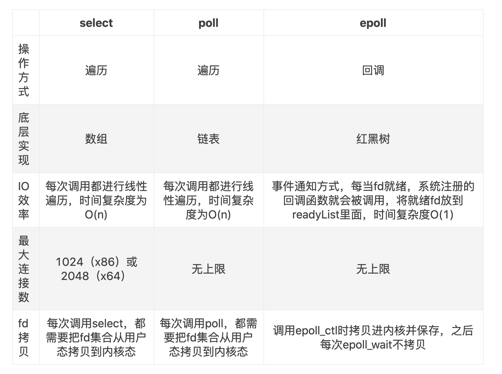

### 进程与线程

- 进程是**资源分配**的最小单位，线程是**程序执行**的最小单位。
- 进程有自己的**独立**地址空间，每启动一个进程，系统就会为它分配地址空间，建立数据表来维护代码段、堆栈段和数据段，这种操作非常昂贵。而线程是**共享**进程中的数据的，使用相同的地址空间，因此CPU切换一个线程的花费远比进程要小很多，同时创建一个线程的开销也比进程要小很多。
- 线程之间的通信更方便，同一进程下的线程共享全局变量、静态变量等数据，而进程之间的通信需要以通信的方式（IPC)进行。不过如何处理好同步与互斥是编写多线程程序的难点。
- 但是多进程程序更健壮，多线程程序只要有一个线程死掉，整个进程也死掉了，而一个进程死掉并不会对另外一个进程造成影响，因为进程有自己独立的地址空间。

线程执行开销小，但是不利于资源的管理和保护。线程适合在SMP机器（双CPU系统）上运行。

进程执行开销大，但是能够很好的进行资源管理和保护。进程可以跨机器前移。

#### 进程通信

1. 管道pipe：管道是一种半双工的通信方式，数据只能单向流动，而且只能在具有亲缘关系的进程间使用。进程的亲缘关系通常是指父子进程关系。
2. 命名管道FIFO：有名管道也是半双工的通信方式，但是它允许无亲缘关系进程间的通信。
3. 消息队列MessageQueue：消息队列是由消息的链表，存放在内核中并由消息队列标识符标识。消息队列克服了信号传递信息少、管道只能承载无格式字节流以及缓冲区大小受限等缺点。
4. 共享存储SharedMemory：共享内存就是映射一段能被其他进程所访问的内存，这段共享内存由一个进程创建，但多个进程都可以访问。共享内存是最快的 IPC 方式，它是针对其他进程间通信方式运行效率低而专门设计的。它往往与其他通信机制，如信号两，配合使用，来实现进程间的同步和通信。
5. 信号量Semaphore：信号量是一个计数器，可以用来控制多个进程对共享资源的访问。它常作为一种锁机制，防止某进程正在访问共享资源时，其他进程也访问该资源。因此，主要作为进程间以及同一进程内不同线程之间的同步手段。
6. 套接字Socket：套解口也是一种进程间通信机制，与其他通信机制不同的是，它可用于不同机器间的进程通信。
7. 信号 ( sinal ) ： 信号是一种比较复杂的通信方式，用于通知接收进程某个事件已经发生。

#### 多线程

和单道程序一样，同一时刻也是只能一个程序占据一颗cpu（多核CPU）。但是和单道程序不同的是，当该程序等待其他资源的时候，它就放弃cpu或者当一个设定的时间到了放弃cpu，让其他程序拥有cpu。该程序不可能一直占据，如此这就避免了cpu空等的情况，让cpu始终有程序运行。因为程序不是一直从开始执行到结束，而是中间走走停停，那就并发问题就会出现。因为当他停止的时候，它所拥有的资源或者它所需要的资源可能会被其他程序修改，这就影响程序运行的正确性。


tips：

对资源的管理和保护要求高，不限制开销和效率时，使用多进程。

要求效率高，频繁切换时，资源的保护管理要求不是很高时，使用多线程。


#### 死锁

概念：多个并发进程因争夺系统资源而产生相互等待的现象。

原理：当一组进程中的每个进程都在等待某个事件发生，而只有这组进程中的其他进程才能触发该事件，这就称这组进程发生了死锁。

本质原因：
​        1) 系统资源有限。
​        2) 进程推进顺序不合理。

死锁产生的4个必要条件
​    1、互斥：某种资源一次只允许一个进程访问，即该资源一旦分配给某个进程，其他进程就不能再访问，直到该进程访问结束。
​    2、占有且等待：一个进程本身占有资源（一种或多种），同时还有资源未得到满足，正在等待其他进程释放该资源。
​    3、不可抢占：别人已经占有了某项资源，你不能因为自己也需要该资源，就去把别人的资源抢过来。

​    4、循环等待：存在一个进程链，使得每个进程都占有下一个进程所需的至少一种资源。


#### 并发和并行

（1）并行是指两个或者多个事件在**同一时刻**发生；而并发是指两个或多个事件在同一时间间隔发生。

（2）并行是在不同实体上的多个事件，并发是在同一实体上的多个事件。

并发：在操作系统中，是指一个时间段中有几个程序都处于已启动运行到运行完毕之间，且这几个程序都是在同一个处理机上运行，但任一个时刻点上只有一个程序在处理机上运行。

并行：在操作系统中，一组程序按独立异步的速度执行，无论从微观还是宏观，程序都是一起执行的。


#### mutex/semaphore

 1：semaphore（信号量）范围比较广，semaphore可能会有多个属性值。比如常见的生产者和消费者问题，就是多元信号量的一种。生产者可以生产多个元素，消费者可以消费的元素必须小于生产者的生产元素个数。从此也可以看出，semaphore是允许多个线程进入，访问互斥资源。除了多元信号量之外，还存在一种二元信号量。即只存在是与否，0与1两种状态。

2：mutex（互斥量）也是一种二元的锁机制，只有是（1）和否（0）的两个值，和二元信号量比较相似。但是它和二元信号量不同的是，占有和释放必须是同一个线程。比如互斥量M被线程A占有，那么释放的时候肯定也是A线程释放的。二元信号量则不必如此，一个二元信号量的占有和释放可以是不同线程。相应的内容也可以移步看一下wiki解释--Synchronization 。mutex是可以用于进程也可以用于线程的同步机制。


### IO

ref:

https://www.jianshu.com/p/b8203d46895c

https://www.jianshu.com/p/397449cadc9a

java io相关：https://my.oschina.net/u/3471412/blog/2966696


**文件描述符**

用于表述指向文件的引用的抽象化概念。在形式上是一个非负整数。实际上，它是一个索引值，指向内核为每一个进程所维护的该进程打开文件的记录表。当程序打开一个现有文件或者创建一个新文件时，内核向进程返回一个文件描述符。在程序设计中，一些涉及底层的程序编写往往会围绕着文件描述符展开。但是文件描述符这一概念往往只适用于UNIX、Linux这样的操作系统。


#### 五种IO模型

1. Blocking IO - 阻塞IO
2. NoneBlocking IO - 非阻塞IO
3. IO multiplexing - IO多路复用
4. signal driven IO - 信号驱动IO（实际使用中并不常用）
5. asynchronous IO - 异步IO

对于一个network IO，它会涉及到两个系统对象：调用这个IO的进程，kernal系统内核。

他们经历的两个阶段是：

1. 等待数据准备
2. 讲数据从内核拷贝到用户进程中（写操作则是数据从用户进程到内核）

之所以会有同步、异步、阻塞和非阻塞这几种说法就是根据程序在这两个阶段的处理方式不同而产生的。

##### 阻塞IO (BIO)

在linux中，默认情况下所有的socket都是blocking，一个典型的读操作流程大概如下图：


当用户进程调用了**recvfrom**这个系统调用，kernel就开始了IO的第一个阶段：准备数据。对于network IO来说，很多时候数据在一开始还没有到达（比如，还没有收到一个完整的UDP包），这个时候kernel就要等待足够的数据到来。而在用户进程这边，整个进程会被阻塞。当kernel一直等到数据准备好了，它就会将数据从kernel中拷贝到用户内存，然后kernel返回结果，用户进程才解除block的状态，重新运行起来。

BIO过程中，CPU将一直被用户进程占有，完成IO操作才能被释放。


##### 非阻塞IO(NIO)

linux下，可以通过设置socket使其变为non-blocking。当对一个non-blocking socket执行读操作时，流程是这个样子：


NIO过程中，用户进程将会在wait for data阶段不断轮询内核，若没有结果马上释放CPU资源。

从图中可以看出，当用户进程发出recvfrom这个系统调用后，如果kernel中的数据还没有准备好，那么它并不会block用户进程，而是立刻返回一个结果（no datagram ready）。从用户进程角度讲 ，它发起一个操作后，并没有等待，而是马上就得到了一个结果。用户进程得知数据还没有准备好后，它可以每隔一段时间再次发送recvfrom操作。一旦kernel中的数据准备好了，并且又再次收到了用户进程的system call，那么它马上就将数据拷贝到了用户内存，然后返回。


##### IO多路复用(IO multiplexing)

I/O多路复用(multiplexing)是网络编程中最常用的模型，像我们最常用的select、epoll都属于这种模型。以select为例：


看起来它与`blocking I/O`很相似，两个阶段都阻塞。但它与blocking I/O的一个重要区别就是它可以等待**多个数据报就绪**（datagram ready），即可以处理多个连接。这里的select相当于一个“代理”，调用select以后进程会被select阻塞，这时候在内核空间内select会监听指定的多个datagram (如socket连接)，如果其中任意一个数据就绪了就返回。此时程序再进行数据读取操作，将数据拷贝至当前进程内。由于select可以监听多个socket，我们可以用它来处理多个连接。

在select模型中每个socket一般都设置成non-blocking，虽然等待数据阶段仍然是阻塞状态，但是它是被select调用阻塞的，而不是直接被I/O阻塞的。select底层通过轮询机制来判断每个socket读写是否就绪。

当然select也有一些缺点，比如底层轮询机制会增加开销、支持的文件描述符数量过少等。为此，Linux引入了epoll作为select的改进版本。

##### 异步IO(AIO)

异步I/O在网络编程中几乎用不到，在File I/O中可能会用到：


**同步异步**：同步方法会一直阻塞进程，直到I/O操作结束，前四种IO方法都是同步方法；异步方法不会阻塞调用者进程，即使是从内核空间的缓冲区将数据拷贝到进程中这一操作也不会阻塞进程，拷贝完毕后内核会通知进程数据拷贝结束。


#### select/poll/epoll

IO多路复用的三种机制。

fd: file descriptor

1. select

提供了long类型的fd数组。每一个数组元素都能与一打开的文件句柄（不管是Socket句柄,还是其他文件或命名管道或设备句柄）建立联系，建立联系的工作由程序员完成，当调用select()时，由内核根据IO状态修改fd_set的内容，由此来通知执行了select()的进程哪一Socket或文件可读。

从流程上来看，使用select函数进行IO请求和同步阻塞模型没有太大的区别，甚至还多了添加监视socket，以及调用select函数的额外操作，效率更差。但是，使用select以后最大的优势是用户可以在一个线程内同时处理多个socket的IO请求。用户可以注册多个socket，然后不断地调用select读取被激活的socket，即可达到在同一个线程内同时处理多个IO请求的目的。而在同步阻塞模型中，必须通过多线程的方式才能达到这个目的。

问题：

- 每次调用select，都需要把`fd_set`集合从**用户态**拷贝到**内核态**，如果`fd_set`集合很大时，那这个开销也很大

- 同时每次调用select都需要在内核遍历传递进来的所有`fd_set`，如果`fd_set`集合很大时，那这个开销也很大

- 为了减少数据拷贝带来的性能损坏，内核对被监控的`fd_set`集合大小做了限制，并且这个是通过宏控制的，大小不可改变(限制为1024)

select过程如下：


select线程不安全


2. poll

poll没有最大文件描述符数量的限制。使用链表存储fd信息。本质和select没区别。

poll还有一个特点是“`水平触发`”，如果报告了fd后，没有被处理，那么下次poll时会再次报告该fd。


3. epoll

epoll没有描述符个数限制，使用一个文件描述符管理多个描述符，将用户关心的文件描述符的事件存放到内核的一个事件表中，这样在用户空间和内核空间的copy只需一次。

>ref:https://zhuanlan.zhihu.com/p/39970630
>
>1. 调用epoll_create()在内核中建立一个epoll对象，
>2. 调用epoll_ctl()向epoll对象中添加连接的套接字
>3. 调用epoll_wait()收集发生的事件的连接
>
>
>
>epoll比select/poll的优越之处：因为后者每次调用时都要传递你所要监控的所有socket给select/poll系统调用，这意味着需要将用户态的socket列表copy到内核态，如果以万计的句柄会导致每次都要copy几十几百KB的内存到内核态，非常低效。而我们调用epoll_wait时就相当于以往调用select/poll，但是这时却不用传递socket句柄给内核，因为内核已经在epoll_ctl中拿到了要监控的句柄列表。


获取事件的时候，它无须遍历整个被侦听的描述符集，只要遍历那些被内核IO事件异步唤醒而加入Ready队列的描述符集合就行了。

epoll除了提供select/poll那种IO事件的水平触发（Level Triggered）外，还提供了边缘触发（Edge Triggered），这就使得用户空间程序有可能缓存IO状态，减少epoll_wait/epoll_pwait的调用，提高应用程序效率。

- **水平触发（LT）：**默认工作模式，即当epoll_wait检测到某描述符事件就绪并通知应用程序时，应用程序可以不立即处理该事件；下次调用epoll_wait时，会再次通知此事件
- **边缘触发（ET）：** 当epoll_wait检测到某描述符事件就绪并通知应用程序时，应用程序必须立即处理该事件。如果不处理，下次调用epoll_wait时，不会再次通知此事件。（直到你做了某些操作导致该描述符变成未就绪状态了，也就是说边缘触发只在状态由未就绪变为就绪时只通知一次）。

LT和ET原本应该是用于脉冲信号的，可能用它来解释更加形象。Level和Edge指的就是触发点，Level为只要处于水平，那么就一直触发，而Edge则为上升沿和下降沿的时候触发。比如：0->1 就是Edge，1->1 就是Level。

ET模式很大程度上减少了epoll事件的触发次数，因此效率比LT模式高。





综上，在选择select，poll，epoll时要根据具体的使用场合以及这三种方式的自身特点。

**1、表面上看epoll的性能最好，但是在连接数少并且连接都十分活跃的情况下，select和poll的性能可能比epoll好，毕竟epoll的通知机制需要很多函数回调。**

**2、select低效是因为每次它都需要轮询。但低效也是相对的，视情况而定，也可通过良好的设计改善** 


#### Reactor

https://segmentfault.com/a/1190000018331509


#### Proactor


### Command

#### Load Avg

三个值表示系统在过去1分钟、5分钟、15分钟内运行进程队列中（运行中进程和可运行进程）的平均数量。
运行队列里包含没有等待IO，没有WAIT，没有KILL的进程。

　　- 它没有在等待I/O操作的结果
　　- 它没有主动进入等待状态(也就是没有调用'wait')
　　- 没有被停止(例如：等待终止)。load用于反映当前系统的负载情况

```shell
> cat /proc/loadavg  #可以看到当前系统的load 

> top
xxx

> uptime	#指令查看load
load averages: 2.67 2.41 2.32
```

##### CPU利用率

意义：衡量CPU的运行状态，超过50-60%将会使CPU处于超负荷运作。程序时延上涨。

和load avg的区别：一段时间内CPU正在处理以及等待CPU处理的进程数之和的统计信息。

- CPU利用率低不代表，代表CPU符合低，并且CPU资源不是性能瓶颈


### Critical Directory

#### /var

>/var/cache：应用程序本身运行过程中会产生生的一些暂存文件。
>
>/var/lib:程序本身执行的过程中需要使用到的数据文件放置的目录。再次目录下各自的软件应该要有各自的目录。举例来说，Mysql的数据库放置到/var/lib/mysql，而rpm的数据库则放到/var/lib/rpm目录下。
>
>/var/lock:某些设备或者是文件资源一次只能被一个应用程序所使用 ，如当系统中有一个刻录机两个人都要使用，那么需要在一个人使用的时候上锁，那么第一个人使用完毕后，第二个人才可以继续使用。
>
>/var/log:这个是登录文件放置日志的的目录。里面比较重要的文件/var/log/messages，/var/log/harry(记录登陆者信息)等。
>
>/var/run/：某些程序启动服务后，会将他们PID放置在这个目录下。

