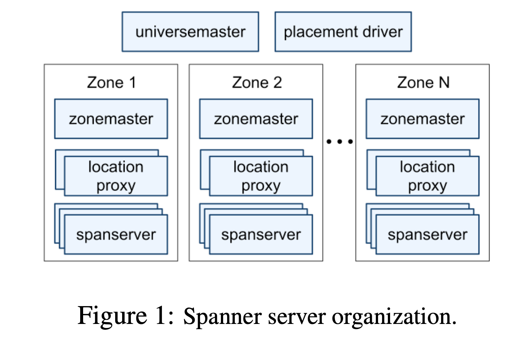
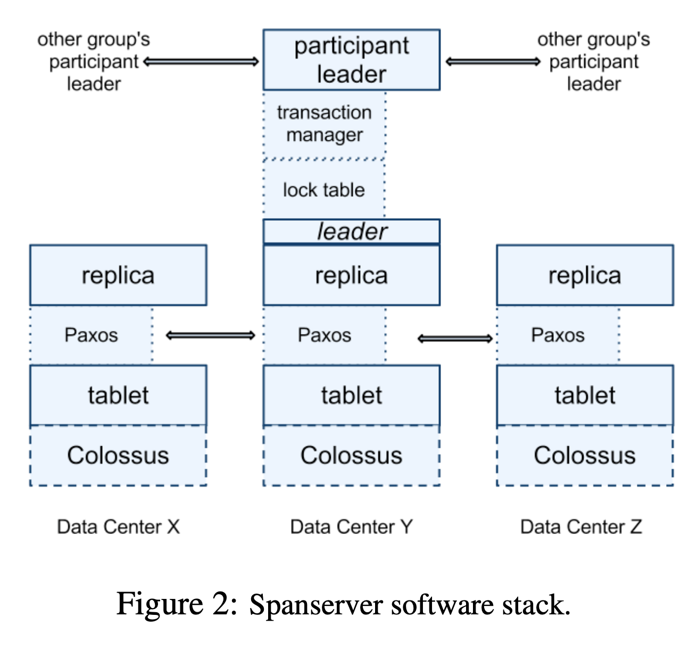

### Implementation

**Universe**: A spanner deployment. Spanner is organized as a set of *zones*.

**Zones**: Zones are the unit of administrative deployment. The set of zones is also the set of locations across which data can be replicated. A zone has one *zonemaster* and between one hundred and several thousand *spanservers*.

**Location Proxy**: The per-zone *location proxies* are used by clients to locate the spanservers assigned to serve their data(store metadata).

**Universe Master**: The universe master is primarily a console that displays status information about all the zones for inter- active debugging.

**Placement Driver**: The placement driver periodically communicates with the spanservers to find data that needs to be moved, either to meet updated replication constraints or to balance load.

#### Software Stack

At the bottom, **each spanserver** is responsible for between 100 and 1000 instances of a data structure called a **tablet**. A tablet is similar to Bigtable’s tablet abstraction.Spanner assigns timestamps to data, which is an important way in which Spanner is more like a multi-version database than a key-value store.

A tablet’s state is stored in set of B-tree-like files and a write-ahead log, all on a distributed file system called Colossus.

At each replica that is a leader, each spannerserver implements a **lock table** to implement concurrency control. The lock table contains the state for *2PC locking*: it maps ranges of keys to lock states.

#### Directory Placement

Directory: a set of contiguous keys that share a common prefix. Supporting directories allows applications to control the lo- cality of their data by choosing keys carefully. A Spanner tablet is a container that may encap- sulate multiple partitions of the row space.

A directory is the **unit of data placement**. All data in a directory has the same replication configuration. When data is moved between Paxos groups, it is moved directory by directory, as shown in Figure 3. 

**Two dimensions**: the number and types of replicas, and the geographic placement of those replicas.

#### Data Model

Spanner’s data model is not purely relational, in that rows must have names. More precisely, every table is required to have an ordered set of one or more primary-key columns.

