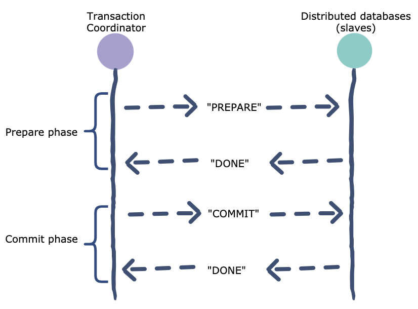

#### Concurrency control

##### Pessimistic

Two Phase Locking

1. acquire lock before using record
2. hold until done

*very easy to generate deadlock

##### Optimistic - OCC

#### Two-Phase-Commit

Used in shared databases/storage systems, which support **transactions**. 

##### Prepare phase

##### Commit phase

##### Failure

- Slave

If slaves crash after they send *done* but have not received *commit*, they have to store their state on the disk. So they will know what to do after it crash and restart, receiving the *commit* message from the coordinator.

Blocking: The slave is **not** allowed to unilaterally abort after PREPARE but receives no COMMIT. TC might have gotten YES from both, and sent out COMMIT to A, but crashed before sending to B. So then A would commit and B would abort: incorrect. Therefore, the phase between the PREPARE and COMMIT is the target people want to make as quick as possible.(Bottle neck)

- Transaction Coordinator

If it crashed after sending one or more commit messages to the slaves, it has to be prepared to conitnue this action after it restarts. Thus, the slaves also have to prepared to receive more than one commit message. 

##### Pros

##### Cons

Slow: Lots of messages.Disk writes in slaves. 

Slaves will be blocked waiting COMMIT from TC, if TC crashes before sending COMMIT.

##### Diff w/ Raft

Raft: make data replicates on multiple servers to ensure the **high availability**. Each server does the same thing. But we only need **the majority of them** be completed.

2PC: Each participant does different parts of things, and **each one** has to correctly finish the task. Does **not** help with availability. If any of the participant crashed, the whole system is influenced.

We can combine both of them. Each participant is a replicated server to store the operation log.