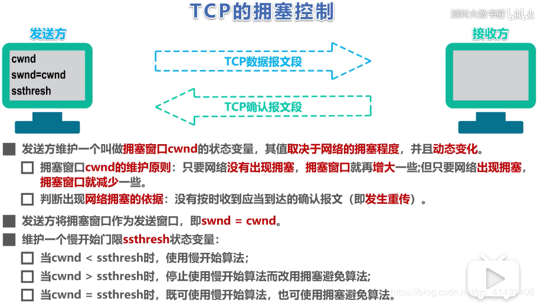

MTU：以太网帧传输最大单元，1500字节。


#### UDP

用户数据报协议

首部8字节


##### 与TCP区别

1. UDP无连接；TCP面相连接
2. UDP尽最大努力交付；TCP提供可靠交付
3. 面向报文；面向字节流
4. UDP无拥塞控制
5. UDP支持一对一、一对多、多对多的交互；每条TCP连接只能是点对点的
6. UDP首部开销小 8字节

##### 应用层协议

| 应用         | 应用层协议 | 运输层协议 |
| ------------ | ---------- | ---------- |
| 域名解析     | DNS        | UDP        |
| 文件传送     | TFTP       | UDP        |
| 路由选择协议 | RIP        | UDP        |
| 电子邮件     | SMTP       | TCP        |
| 远程终端接入 | TELNET     | TCP        |
| 万维网       | HTTP       | TCP        |
| 文件传送     | TFP        | TCP        |

### TCP

#### 发送过程

TCP协议为通信双方维持一个连接，并且在内核中存储相关数据。这部分数据中的TCP头部信息和TCP内核缓冲区（发送和接收）一起构成了TCP报文段。当发送端应用程序使用send（或write）函数向一个TCP连接写入数据时，内核中的TCP模块首先把这些数据复制到与该连接对应的TCP内核发送缓冲区。然后tcp模块调用ip模块提供的服务，传递参数包括tcp头部信息和TCP发送缓冲区中的数据。


#### TCP首部

一个TCP报文分为首部和数据。TCP的全部功能体现在它首部中各字段的作用。其中前**20个字节**是固定的。选项和填充字段这4n字节是根据需而增加的。


源端口号：表示发送端端口号，字段长16位。

目标端口号：表示接收端端口号，字段长度16位。

**序列号**：字段长32位。序列号是指发送数据的位置。每发送一次数据，就累加一次该数据字节数的大小。序列号不会从0或1开始，而是在建立连接时由计算机生成的随机数作为其初始值，通过SYN包传给接收端主机。然后再将每转发过去的字节数累加到初始值上表示数据的位置。此外，在建立连接和断开连接的时发送的SYN包和FIN包虽然并不携带数据，但是也会作为一个字节增加对应的序列号。

**确认应答号**：确认应答号字段长度为32位。是指下一次应该收到的数据的序列号。实际上，它是指已收到确认应答号减一为止的数据。发送端接收到这个确认应答号以后可以认为在这个序列号以前的数据都已经被正常接收。

数据偏移：该字段表示TCP所传输的数据部分应该从TCP包的哪个位开始，当然也可以把它看做TCP首部的长度。该字段长4位，单位为4字节（32位）。

保留：该字段主要是为了以后扩展时使用，其长度为4位，一般设置为0，但即使收到的包在该字段不为0，此包也不会被丢弃。

**控制位**：字段长为8位，每一个从左到至右分别为CWR，ECE，URG，ACK，PSH、RST、SYN、FIN。这些控制标志也叫作控制位。当它们对应位上的值为1时，具体含义如


- ACK：该位为1时，确认应答的字段变为有效。TCP规定在建立连接后，所有传送的报文段都把ACK置1。
- SYN：在连接建立时来同步序号。当SYN=1而ACK=0时，表明这是一个连接请求报文段。
- FIN：当FIN=1，表明发送方的数据已发送完毕，要求释放连接。
- RST：为1时，表明TCP连接中出现严重差错（主机崩溃或其他原因），必须释放而重新建立运输连接。还可以用来拒绝一个非法的报文或拒绝打开一个连接。

**窗口**： 占2字节，窗口值[0, 2^6-1]之间的整数。作为接收方让发送方设置其发送窗口的依据。


##### 分片大小

- tcp分组

tcp是可靠传输协议，通过超时与重传机制，来保证收到的数据是完整的。因为tcp是可靠
传输协议，如果要传输的数据大于 1480 - 20(tcp头部) =1460Byte时，在ip层被分片，而
ip层分片会导致，如果其中的某一个分片丢失，因为tcp层不知道哪个ip数据片丢失，所以
就需要重传整个数据段，这样就造成了很大空间和时间资源的浪费，为了解决这个问题，
就有了**tcp分组和MSS（最长报文大小）概念，利用tcp三次握手建立链接的过程，交互各自的**
**MTU，然后用小的那个MTU-20-20 , 得到MSS，这样就避免在ip层被分片。**


- udp：由于udp是不可靠传输的，所以ip分片主要是为了upd服务的，所以就有了网上的
  1500 - 20(ip头部) - 8(udp头部) > 1472 的说法，把1472作为ip分片的标准


#### TCP连接


##### 三次握手

第三次握手的存在是为了避免如下情况：client发送了一个同步请求A，结果这个请求在链路中的某个节点滞留很久导致client认为它不可到达server端，因此发了第二个请求。然而第一个请求之后还是到达了server。如果此时只有两次握手，那么server认为和client已经建立了连接，监听端口，但实际client没有数据过来，浪费了server资源。

而使用三次握手，在刚才的异常情况下，client不会向srv发出确认，B由于收不到确认，就知道client刚才没有要求建立连接，在一段时间后会退出SYN_RCVD状态。

##### 四次挥手

client最后一个请求为什么等待2MSL（最长报文段寿命）？

1. 为了保证A发送的最后一个ACK报文能够到达B。这个ACK报文可能会丢失，因而使出在LAST_ACK状态的B收不到对已发送的FIN+ACK报文段的确认。B会超时重传这个FIN+ACK报文段，而A就能在这个2MSL时间中收到这个重传的FIN+ACK。接着A会重传一次ACK=y+2，重启2MSL计时器。这样A和B最后都能正常进入CLOSED状态。
2. 防止上一次连接中已失效的报文出现在本连接中。经过2MSL，上次连接中的报文会全部消失。


##### 服务端大量TIME_WAIT

在高并发的TCP服务器上，会出现大量socket处于TIME_WAIT状态，造成的影响是：

> 1. 使服务器在短时间范围内同时占用大量端口，而端口有0-65535范围，可能会不够用
> 2. 业务处理+数据传输时间 远小于 TIMEWAIT超时时间


查看TIMEWAIT情况：

Ref:https://blog.csdn.net/twt936457991/article/details/90574284

```bash
netstat -n |grep TIME_WAIT
```

如何处理：

编辑内核文件/etc/sysctl.conf，加入以下内容：

```
net.ipv4.tcp_syncookies = 1 表示开启SYN Cookies。当出现SYN等待队列溢出时，启用cookies来处理，可防范少量SYN攻击，默认为0，表示关闭；
net.ipv4.tcp_tw_reuse = 1 表示开启重用。允许将TIME-WAIT sockets重新用于新的TCP连接，默认为0，表示关闭；
net.ipv4.tcp_tw_recycle = 1 表示开启TCP连接中TIME-WAIT sockets的快速回收，默认为0，表示关闭。
net.ipv4.tcp_fin_timeout 修改系默认的 TIMEOUT 时间 
```

然后执行 /sbin/sysctl -p 让参数生效。

> 1. **tcp_tw_recycle**：顾名思义就是回收TIME_WAIT连接。可以说这个内核参数已经变成了大众处理TIME_WAIT的万金油，如果你在网络上搜索TIME_WAIT的解决方案，十有八九会推荐设置它，不过这里隐藏着一个不易察觉的陷阱：
>
> 当多个客户端通过NAT方式联网并与服务端交互时，服务端看到的是同一个IP，也就是说对服务端而言这些客户端实际上等同于一个，可惜由于这些客户端的时间戳可能存在差异，于是乎从服务端的视角看，便可能出现时间戳错乱的现象，进而直接导致时间戳小的数据包被丢弃。参考：tcp_tw_recycle和tcp_timestamps导致connect失败问题。
>
> 2. **tcp_tw_reuse**：顾名思义就是复用TIME_WAIT连接。当创建新连接的时候，如果可能的话会考虑复用相应的TIME_WAIT连接。通常认为「tcp_tw_reuse」比「tcp_tw_recycle」安全一些，这是因为一来TIME_WAIT创建时间必须超过一秒才可能会被复用；二来只有连接的时间戳是递增的时候才会被复用。官方文档里是这样说的：如果从协议视角看它是安全的，那么就可以使用。这简直就是外交辞令啊！按我的看法，如果网络比较稳定，比如都是内网连接，那么就可以尝试使用。
>
> 不过需要注意的是在哪里使用，既然我们要复用连接，那么当然应该在连接的发起方使用，而不能在被连接方使用。举例来说：客户端向服务端发起HTTP请求，服务端响应后主动关闭连接，于是TIME_WAIT便留在了服务端，此类情况使用「tcp_tw_reuse」是无效的，因为服务端是被连接方，所以不存在复用连接一说。让我们延伸一点来看，比如说服务端是PHP，它查询另一个MySQL服务端，然后主动断开连接，于是TIME_WAIT就落在了PHP一侧，此类情况下使用「tcp_tw_reuse」是有效的，因为此时PHP相对于MySQL而言是客户端，它是连接的发起方，所以可以复用连接。


#### 可靠传输

理想的传输条件：

1. 传输信道不产生差错
2. 不管发送方以多快的速度发送数据，接收方总是来得及处理收到的数据。

然后实际的网络不具备以上两个条件，因此：

1. 当出现差错时让发送方重传出现的差错的数据（重传机制）
2. 在接收方来不及处理收到的的数据时，及时告知发送方适当降低发送数据的速度（流量控制）


##### 停止等待协议

全双工通信中，每发送完一个分组就停止发送，等待对方的确认，在收到确认后再发送下一个分组。


##### 超时重传

发送方A，接收方B

A只要超过了一段时间没有收到报文的确认，就认为刚才发送的分组丢失了，因而重传前面发送过的分组，这就是**超时重传**。实现超时重传需要一个**超时计时器**。A为每个分组都摄制一个超时计时器。但A只要在超时计时器到期前收到相应的确认，就撤销超时计时器。

注意：

1. A发送完每个分组后，必须暂时保留已发送的分组的副本，收到相应确认后才清楚副本。
2. 分组和确认分组都进行编号
3. 重传时间应当比数据在分组传输的**平均往返时间**更长一点。


**确认丢失**

假设B发送的对分组M1的确认丢失了。A在设定的超时重传时间内没有收到确认，并无法知道是自己发送的分组丢失、出错，或者是B发送的确认丢失了。因此A在超时之后就要重传M1。那么B又会收到重传的分组M1。

此时B：

1. 丢弃这个重复的分组M1，不向上交付
2. 向A发送确认。因为A还是处于没有收到分组M1确认的状态。


**确认迟到**

假设上述情况中，报文的确认实际没有丢失，但迟到了。A会收到重复的确认。A收下后就丢弃。

B仍然会收到重复的M1，丢弃这个重复分组，并向A发送确认。


上述的确认和重传机制，被称为**自动重传请求ARQ（Automatic Repeat Request）**


##### 连续ARQ协议

由于对每个分组都**停止等待协议**会影响信道利用率，因此考虑使用基于**滑动窗口**的**连续ARQ协议**

例如发送窗口大小是5，发送方将5个分组连续发送出去，每收到一个确认，就把发送窗口向前滑动一个分组的位置。

接收方一般采用**累计确认**的方式，在收到几个分组后，对按序到达的最后一个分组发送确认。表示到这个分组之前（包括它）的所有分组都已经正确收到。

优点：简单容易实现

缺点：不能像发送方反应接收方已经正确收到的所有分组的信息。例如发送了5个分组，中间第三个分组丢失了，那接收方只会对前2个分组发出确认。发送方只能把后三个分组都重传一次。这被称为**Go-back-N**（回退N）。

可见当**通信线路质量不好**时，连续ARQ协议会带来**负面**的影响。


##### 以字节为单位的滑动窗口

- TCP滑动窗口是以字节为单位的。

- 发送方A维护一个发送窗口，接收方B维护一个接收窗口。

- 凡事已经发送过的数据，在未收到确认之前都必须暂时保留，以便在超时重传时使用。

- 发送窗口一定不能超过接受窗口数值。
- 变化情况有两种：不动（没有收到新的确认）、前移（收到了新的确认）；发送窗口后沿不可能向后移动
- 对没有按序达到的数据先临时存放在接收窗口中，等到字节流中缺少的字节收到后，再**按序交付上层的应用进程**

维护三个指针：P1, P2, P3

P3 - P1 = A的发送窗口

P2 - P1 = 已发送但尚未收到确认的字节数

P3 - P2 = 允许发送但当前尚未发送的字节数（**可用窗口**）


#### 服务端问题

##### 大量close_wait

大量请求而导致的超时，客户端在发送FIN之后，没有继续发送TIME_WAIT

##### 大量time_wait

服务器调用大量下游接口。内核参数没做优化

```shell
# edit /etc/sysctl.conf

#对于一个新建连接，内核要发送多少个 SYN 连接请求才决定放弃,不应该大于255，默认值是5，对应于180秒左右时间  
net.ipv4.tcp_syn_retries=2 
#net.ipv4.tcp_synack_retries=2 
#表示当keepalive起用的时候，TCP发送keepalive消息的频度。缺省是2小时，改为300秒 
net.ipv4.tcp_keepalive_time=1200 
net.ipv4.tcp_orphan_retries=3 
#表示如果套接字由本端要求关闭，这个参数决定了它保持在FIN-WAIT-2状态的时间 
net.ipv4.tcp_fin_timeout=30   
#表示SYN队列的长度，默认为1024，加大队列长度为8192，可以容纳更多等待连接的网络连接数。 
net.ipv4.tcp_max_syn_backlog = 4096 
#表示开启SYN Cookies。当出现SYN等待队列溢出时，启用cookies来处理，可防范少量SYN攻击，默认为0，表示关闭 
net.ipv4.tcp_syncookies = 1 
   
#表示开启重用。允许将TIME-WAIT sockets重新用于新的TCP连接，默认为0，表示关闭 
net.ipv4.tcp_tw_reuse = 1 
#表示开启TCP连接中TIME-WAIT sockets的快速回收，默认为0，表示关闭 
net.ipv4.tcp_tw_recycle = 1 
   
##减少超时前的探测次数  
net.ipv4.tcp_keepalive_probes=5  
##优化网络设备接收队列  
net.core.netdev_max_backlog=3000 
```


#### 流量控制

流量控制（flow control）让发送方的发送速率不要太快，要让接收方来得及接收。利用滑动窗口机制可以方便地在TCP连接上实现对发送方的流量控制。窗口的单位是**字节**，不是报文段。

考虑一种情况：B向A发送了零窗口的报文段后不久，B的接收缓存又有了一些存储空间，于是B向A发送了rwnd=400的报文段。然而这个报文段在传送过程中丢失了。A一直等待B发送的非零窗口的通知，而B也一直等待A发送的数据。如果没有其他措施，这种死锁局面将一直持续。

解决方法：TCP为每一个连接设有**持续计时器（persistence timer）**。只要TCP连接的一方收到对方的零窗口通知就启动计时器。若持续计时器设置的时间到期，就发送一个零窗口**探测报文段**（仅携带1字节的数据），对方在确认这个探测报文段时给出现在的窗口值。如果窗口值还为零，则发送房就刷新**持续计时器**， 如果不是零则打破死锁僵局。


##### 糊涂窗口综合症

当发送端应用进程产生数据很慢、或接收端应用进程处理接收缓冲区数据很慢，或二者兼而有之；就会使应用进程间传送的报文段很小，特别是有效载荷很小。 极端情况下，有效载荷可能只有1个字节；而传输开销有40字节(20字节的IP头+20字节的TCP头) 这种现象就叫糊涂窗口综合症。


##### Nagle算法

Ref:https://www.cnblogs.com/zhaoyl/archive/2012/09/20/2695799.html

TCP/IP协议中，无论发送多少数据，总是要在数据前面加上协议头，同时，对方接收到数据，也需要发送ACK表示确认。为了尽可能的利用网络带宽，TCP总是希望尽可能的发送足够大的数据。（一个连接会设置MSS参数，因此，TCP/IP希望每次都能够以MSS尺寸的数据块来发送数据）。Nagle算法就是为了尽可能发送大块数据，避免网络中充斥着许多小数据块。
     Nagle算法的基本定义是**任意时刻，最多只能有一个未被确认的小段**。 所谓“小段”，指的是小于MSS尺寸的数据块，所谓“未被确认”，是指一个数据块发送出去后，没有收到对方发送的ACK确认该数据已收到。
     从Nagle算法生效情况的补集，可以侧面理解其本质，参考tcp_output.c文件里tcp_nagle_check函数：

​    （1）如果包长度达到MSS，则允许发送；

​    （2）如果该包含有FIN，则允许发送；

​    （3）设置了TCP_NODELAY选项（意在禁止nagle），则允许发送；

​    （4）未设置TCP_CORK选项时，若所有发出去的小数据包（包长度小于MSS）均被确认，则允许发送； 

​    （5）上述条件都未满足，但发生了超时（一般设置延迟ACK，一般为200ms），则立即发送。

　　 通常我们比较关注的是情况(1)和(5)。

​     Nagle算法只允许一个未被ACK的包存在于网络，它并不管包的大小，因此它事实上就是一个扩展的停-等协议，只不过它是基于包停-等的，而不是基于字节停-等的。Nagle算法完全由TCP协议的ACK机制决定，这会带来一些问题，比如如果对端ACK回复很快的话，Nagle事实上不会拼接太多的数据包，虽然避免了网络拥塞，网络总体的利用率依然很低。


#### 拥塞控制

网络的资源：计算机网络中的链路容量（带宽）、交换结点中的缓存和处理机。

对网络中某一资源的需求超过了该资源所能提供的可用部分，网络性能就会变差，称为**拥塞**。

拥塞控制的目的：**防止过多的数据注入到网络中，这样可以使网络中的路由器或链路不致过载。**

和流量控制的区别：流量控制往往是指点到点通信量的控制，是个端到端的问题。抑制发送端发送数据的速率，以便使接收端来得及接收。

监控网络拥塞的指标：

- 由于缺少缓存空间而被丢失的分组的百分数
- 平均队列长度
- 超时重传的分组数
- 平均分组延时
- 分组时延的标准差


TCP具体的拥塞控制的算法：慢开始(slow-start)、拥塞避免(congestion avoidance)，快重传(fast retransmit)，快恢复(fast recovery)

##### 慢开始

cwnd：拥塞窗口(congestion window)

ssthreash：慢开始门限

当主机开始发送数据时，由小到大逐渐增大发送窗口，由小到大逐渐增大拥塞窗口数值。每经过一个传输轮次(transmission round)，拥塞窗口cwnd就**加倍**。

##### 拥塞避免

在该阶段，cwnd按现行规律缓慢增长，一个往返时间RTT就加1。

- 当发生超时，令ssthreash=cwnd/2，cwnd=1。




##### 快重传

快重传算法规定，接收方即使收到了时许的报文也要立即发出对已收到的报文的重复确认，让发送方尽早知道发生了个别报文段的丢失。发送方先后发送了M1、M2、M3，但是M3丢失，**接收方**必须立即发送对M2的重复确认，发送方只要一连收到**3个重复确认**就知道接收方确实没收到报文段M3，立即进行重传。

##### 快恢复

按照快重传中的描述，发送房知道现在丢失的只是个别的报文段，而是执行快恢复算法。

- 当发送方一连收到3个对同一个报文的重复ACK时，令ssthreash=cwnd/2， cwnd =ssthreash，并开始执行**拥塞避免**算法。


#### 指令

##### ping

```shell
ping -l $SIZE		#单位为字节
```

基于ICMP协议，属于网际层。


- 返回结果：

```
"Request Timed Out"这个信息表示对方主机可以到达到 TIME OUT，这种情况通常是为 对方拒绝接收你发给它的数据包造成数据包丢失。 大多数的原因可能是对方装有防火墙或已 下线。

"Destination Net Unreachable"这个信息表示对方主机不存在或者没有跟对方建立连接。 这里要说明一下"destination host unreachable"和"time out"的区别，如果所经过的路由器的 路由表中具有到达目标的路由，而目标因为其它原因不可到达，这时候会出现"time out"， 如果路由表中连到达目标的路由都没有，那就会出现"destination host unreachable"。

"Bad IP address" 这个信息表示你可能没有连接到 DNS 服务器所以无法解析这个 IP 地 址，也可能是 IP 地址不存在。

"Source quench received"信息比较特殊，它出现的机率很少。它表示对方或中途的服务 器繁忙无法回应。
```


##### traceroute

同样也是基于ICMP。利用IP数据报的TTL字段，指定数据包最多能经过几次路由。每经过一个路由器就会对TTL减1，当为0时，不做转发。


#### ARP协议

主机向自己所在的网络广播一个ARP请求，该请求包含目标机器的网络地址。此网络上的其他机器都将收到这个请求，但只有被请求的目标机器会回应一个ARP请求，其中包含自己的物理地址。


### socket

一组提供访问tcp/ip协议栈的系统调用。

提供功能：

1. 将应用程序数据从用户缓冲区复制到TCP/UDP内核发送缓冲区。
2. 修改内核中各层协议的某些头部信息，比如设置IP数据报在网络上的存活时间。

##### api

https://www.cnblogs.com/cy568searchx/p/4211124.html