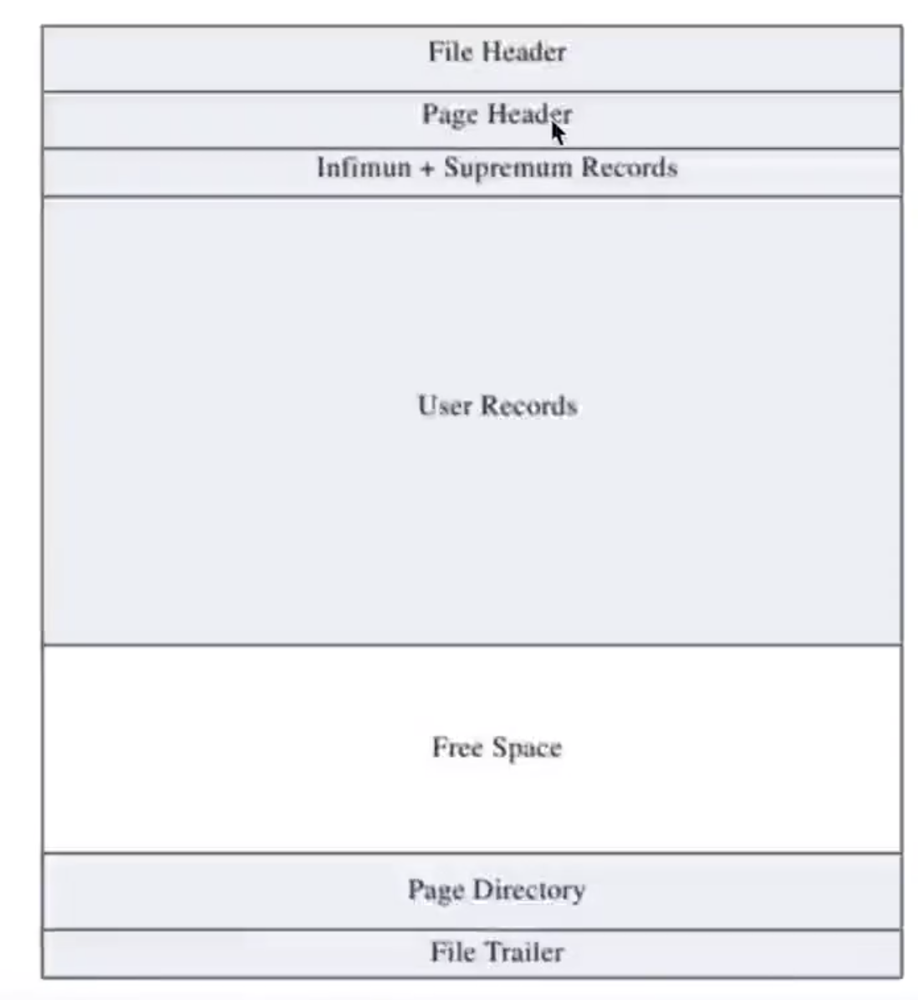
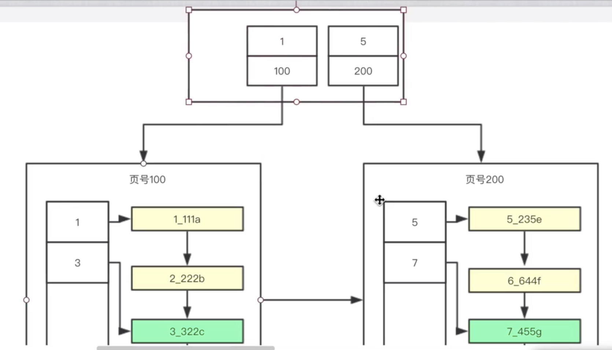
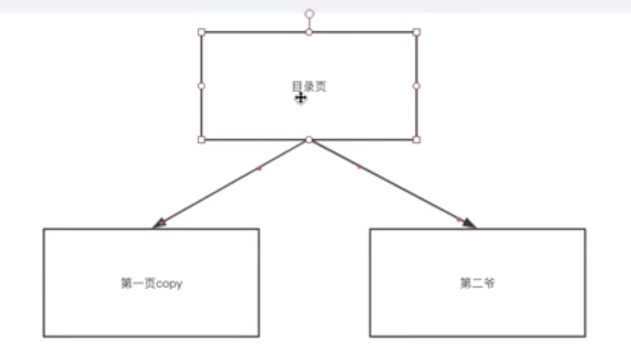
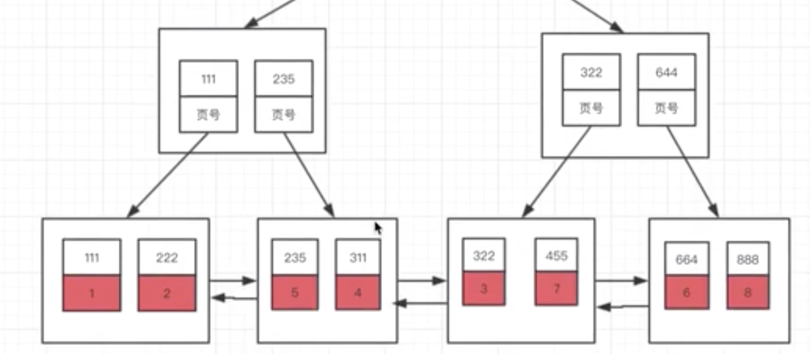

### 常用指令

终端可使用mycli作为客户端连接数据库；可视化界面可使用navicat，但是要教育注册或者破解版

```mysql
#安装 mycli (for mac)
brew install mycli

```


### 存储引擎

常见存储引擎有Innodb, MyISAM, Memory等。数据在不同存储引擎中存放的格式也是不同的，比如Memory不用磁盘来存储数据，直接存储在内存中。

#### Innodb页结构 

现在互联网公司常用的为Innodb。在Innodb中数据会存储到磁盘上，在真正处理数据时需要先将数据加载到内存中，表中读取某些记录时，不需要一条条把记录从磁盘上读出来，它将数据划分为若干个**页**，以页作为磁盘和内存交互的基本单位，一**页大小为16K**。

页结构：



Page Header: 数据页

File Header: 所有类型页公用的头部

**User Records:** 用户记录，插入、删除等行为的记录 

Free Space: 用户记录区的空闲部分，其实也是User Records的一部分

Page Directory: 页中某些记录的相对位置，**多个行记录并为一组，加速查询**；由于是顺序排列的，所以可以二分查找，加速。

#### 行格式

Innodb行格式有：Compact, Redundant, Dynamic, Compressed。默认为Dynamic

```mysql
create table my_table (coloumns...) ROW_FORMAT=行格式名称
```

Innodb一行的字段（**除去blob类型**）空间和最多不超过**65535字节**(64KB)，否则不让创建；


##### Compact格式


包含：变长字段长度列表、NULL值列表、记录头信息、列1数据、列2数据。。。

1. 变长字段长度列表（2字节）

MySql支持一些变长的数据类型，例如varchar、varbinary、text、blob类型。变长数据类型存储的字节是不固定的，所以在存储真实数据时要把这些数据占用的字节数也存起来。Compact格式中把所有变长字段的真实数据占用的字节长度都存放在开头部位，变成一个列表（由于字段是有序的，所以不需要用kv键值对）。

VARCHAR(M)，M代表能存多少个字符。(mysql5.0.3以前是字节，现在是字符)

*没有可变字段时，这个列表可以去掉

2. NULL值列表（1字节）

处理空字段有两种方法：1）用$标志空字段，但是浪费空间；2）使用NULL值列表

Compact会把可以为NULL的列统一管理起来，存一个标记为在NULL值列表中，如果表中没有允许存储NULL的列，则NULL值列表页不存在。

- 二进制为1时，表示该列值为NULL
- 二进制为0时，表示该列值不为NULL

*没有可为NULL的字段时这个列表可以去掉


3. 记录头信息

用于描述的记录头信息，由固定的5个字节（40位二进制）组成。

- delete_mask: 1bit, 标记该条目是否被删除
- min_rec_mask: 1bit, B+树的每层非叶子节点中的最小记录都会添加该标记
- n_owned: 4bit, 表示当前记录拥有的记录数
- next_record: 16bit, 表示下一条记录的相对位置(innodb排序)


4. 隐藏列

- **row_id**: 非必须，6bit, 行ID，唯一标识一条记录；在既没有主键也没有唯一索引时才会存在
- Transaction_id: 必须有 6bit, 事务ID
- roll_pointer: 必须有，7bit，回滚指针 

#### 行溢出数据

```mysql
create table var_size_test(
	c varchar(65535)
) charset=ascii ROW_FORMAT=Compact;

#会报错，每行字段数据（除开blob类型）的和必须<65535个字节
```


当一行数据超过页大小（16kB）时，将会被存到多个页中，这种情况称为行溢出。

此时有两种解决方法：

1. 存部分数据+下一页的地址
2. 只存下一页的地址：一页可以存更多行的记录


**在Compact和Redundant**行格式中，对于占用存储空间大的列，在记录真实数据处只会存储该列的一部分数据，把剩余的数据分散存储到其他几个页中，然后记录的真实数据处用20个字节存指向这些页的地址和这些页中包含数据的字节数。

在Dynamic和Compressed行格式中，它们不会在记录的真实数据处存储一部分数据，而是把所有的数据存储到其他页面中，只在真实数据处存储其他页面的地址。此外，Compressed行格式会采用压缩算法对页面进行压缩。


#### Innodb和MyISAM区别

MyISAM是MySQL的默认数据库引擎（5.5版之前），由早期的ISAM（Indexed Sequential Access Method：有索引的顺序访问方法）所改良。虽然性能极佳，但却有一个缺点：**不支持事务处理**（transaction）。不过，在这几年的发展下，MySQL也导入了InnoDB（另一种数据库引擎），以强化参考完整性与并发违规处理机制，后来就逐渐取代MyISAM。

InnoDB，是MySQL的数据库引擎之一，为MySQL AB发布binary的标准之一。InnoDB由Innobase Oy公司所开发，2006年五月时由甲骨文公司并购。与传统的ISAM与MyISAM相比，InnoDB的最大特色就是支持了ACID兼容的事务（Transaction）功能，类似于PostgreSQL。目前InnoDB采用双轨制授权，一是GPL授权，另一是专有软件授权。

主要区别：

ref: https://blog.csdn.net/lc0817/article/details/52757194


> 1. **InnoDB支持事务，MyISAM不支持，** **这一点是非常之重要。**事务是一种高级的处理方式，如在一些列增删改中只要哪个出错还可以回滚还原，而MyISAM就不可以了。
> 2. MyISAM适合查询以及插入为主的应用；InnoDB适合频繁修改以及涉及到安全性较高的应用。
> 3. InnoDB支持外键，MyISAM不支持。
> 4. 从MySQL5.5.5以后，InnoDB是默认引擎。
> 5. InnoDB不支持FULLTEXT类型的索引。MyISAM支持。
> 6. InnoDB中不保存表的行数，如select count(*) from table时，InnoDB需要扫描一遍整个表来计算有多少行，但是MyISAM只要简单的读出保存好的行数即可。注意的是，当count(*)语句包含where条件时MyISAM也需要扫描整个表。
> 7. 对于自增长的字段，InnoDB中必须包含只有该字段的索引，但是在MyISAM表中可以和其他字段一起建立联合索引。
> 8. DELETE FROM table时，InnoDB不会重新建立表，而是一行一行的 删除，效率非常慢。MyISAM则会重建表。
> 9. InnoDB支持行锁（某些情况下还是锁整表，如 update table set a=1 where user like '%lee%'；MyISAM只有表锁select，update，delete，insert语句都会给表自动加锁。
> 10. 如果表没有任何索引和**主键**，MyISAM的索引会保存行的地址；Innodb自动生成一个6字节的rowid作为主键


事务处理：

- MyISAM强调性能，执行速度比Innodb类型更快，但不提供事务支持
- Innodb：支持事务 commit, rollback等

锁级别：

- MyISAM：只支持表级锁，用户在操作MyISAM表时，select，update，delete，insert语句都会给表自动加锁，如果加锁以后的表满足insert并发的情况下，可以在表的尾部插入新的数据。
- InnoDB：支持事务和行级锁，是innodb的最大特色。行锁大幅度提高了多用户并发操作的新能。但是InnoDB的行锁，只是在WHERE的主键是有效的，非主键的WHERE都会锁全表的。


### 索引

MyISAM引擎，如果插入数据之后不加任何索引，查出来的顺序和插入的顺序保持一致。


Innodb在插入后会自动根据主键排好序。如果没有定义主键，则会看有没有定义唯一索引；如果还没有唯一索引，则会使用额外的**row_id(隐藏列**)

#### 主键索引(b+ tree)

方法：页+页目录+数据

排序的好处：顺序查找时可剪枝。

原理：B+树




#### 起始页频繁变动



建表的时候开一个页；需要扩展页的时候不会直接开第二页，会先把第一页copy一份再开辟第二页，然后把原先的第一页改成起始页，这样起始页就会一直是一个页；因此就可以把这个起始页**加载到内存**中，加速查找


#### 聚集索引

特点：

1. 表记录的排序顺序和索引的排序顺序一致。
2. 全表只能有一个聚集索引（Mysql中就是主键）。
3. 按主键值的大小进行记录和页的排序
4. 修改慢，因为要维持物理顺序和索引顺序一致
5. Innodb中聚集索引的叶子节点就是对应的数据节点。*但MyISAM中不是，该存储引擎中的聚集索引比非聚集索引值多了一个唯一约束，其他没有区别。

>最好在创建表的时候创建聚集索引，因为之后再添加聚集索引会根据索引列的排序顺序移动全部数据行上的顺序，开销很大。


##### 非聚集索引

1. 除了聚集索引以外的索引都是非聚集索引
2. 如果使用非聚集索引查询，而查询列中包含了其他该索引没有覆盖的列，那么还要回表进行第二次的查询，查询节点上对应的数据行的数据。
3. 非聚集索引的叶子节点除了会存储**索引本身覆盖列**的数据，也会存放该表**聚集索引**所覆盖的列数据。


##### 二级索引

即辅助索引。叶子节点中存储主键值，每次查找数据时，根据索引找到叶子节点中的主键值，根据主键值再到聚簇索引中得到完整的一行记录。InnoDB中主键所建立的是聚簇索引，而唯一索引、普通索引、前缀索引等都是二级索引。

**为什么使用？**聚簇索引的叶子节点存储了一行完整的数据，而二级索引只存储了主键值，相比于聚簇索引，占用的空间要少。查询时磁盘io时间也更少。可对较小的列建立二级索引来加速count(*)方法。


#### 多列索引



index_bcd用b,c,d三列作为索引；红色的部分只存一个主键，之后再用主键索引去查找真实数据。

```mysql
explain select * from my_table where b = 1 and c = 1 and d = 1;	#全值匹配
```

使用explain关键字查看是否用到索引

查找的过程可能是：辅助索引+回表；或全表暴力匹配

决定查询是否使用索引的是条件语句和已建的索引。


##### 最左前缀原则

```mysql
select * from my_table where b = 1;
```

这样的非全值匹配也能用到index_bcd，因为1**可以和多列索引中的关键字进行比较


```mysql
select * from my_table where c = 1; 
```

但是这样的条件语句是不能用index_bcd的，因为\*1\*不可以做比较


如果只给出后缀或者中间的某个字符串，是用不到索引的

```mysql
select * from my_table where b like '%101%';
```


##### 匹配范围值

```mysql
select * from my_table where b > 1 and b < 8;
```

先找到b为1最大的节点，再一路往后遍历，直到遇到b=8的节点。


可能用不到索引，只在查第一个条件的时候肯定用索引，但是第一个查询条件返回的结果c不一定是有序的；此时查询优化器会做出全表查询的判断。

```mysql
select * from my_table where b > 1 and c > 1;
```


用索引

```mysql
select * from my_table where b = 1 and c > 1;
```


##### order by

索引其实已经做了排序的功能，利用最左前缀原则，可以利用索引加速查询

此时按第一个条件从index_bcd检索出来的数据已经是按c,d排好序的了。当然orderby的字段顺序也要和索引的顺序保持一致。如果不利用索引的话，则会将所有数据取到内存，并在内存中进行排序。

```mysql
select * from my_table where b = 1 order by c,d;
```


##### group by

对已经排好序的数据分组会更快，但前提也得利用到最左前缀

```mysql
select * from my_table group by c,d		#不能利用到索引

select * from my_table where b = 1 group by c,d #能够利用索引加速
```


#### 优缺点

>**创建索引可以大大提高系统的性能（优点）：**
>
>1.通过创建唯一性索引，可以保证数据库表中每一行数据的唯一性。
>
>2.可以大大加快数据的检索速度，这也是创建索引的最主要的原因。
>
>3.可以加速表和表之间的连接，特别是在实现数据的参考完整性方面特别有意义。
>
>4.在使用分组和排序子句进行数据检索时，同样可以显著减少查询中分组和排序的时间。
>
>5.通过使用索引，可以在查询的过程中，使用优化隐藏器，提高系统的性能。
>
>**增加索引也有许多不利的方面(缺点)：**
>
>1.创建索引和维护索引要耗费时间，这种时间随着数据量的增加而增加。
>
>2.索引需要占物理空间，除了数据表占数据空间之外，每一个索引还要占一定的物理空间，如果要建立聚簇索引，那么需要的空间就会更大。
>
>3.当对表中的数据进行增加、删除和修改的时候，索引也要动态的维护，这样就降低了数据的维护速度。


**适合建立索引的列**：

>（1）在**经常需要搜索**的列上（常出现在where语句后的列），可以加快搜索的速度；
>
>（2）在作为主键的列上，强制该列的唯一性和组织表中数据的排列结构；
>
>（3）在经常用在连接的列上，这些列主要是一些**外键**，可以加快连接的速度；
>
>（4）在经常需要根据**范围搜索**的列上创建索引，因为索引已经排序，其指定的范围是连续的；
>
>（5）在经常需要**排序**的列上创建索引，因为索引已经排序，这样查询可以利用索引的排序，加快排序查询时间；

**不应创建的列**：

>（1）对于那些在查询中很少使用或者参考的列不应该创建索引。
>
>这是因为，既然这些列很少使用到，因此有索引或者无索引，并不能提高查询速度。相反，由于增加了索引，反而降低了系统的维护速度和增大了空间需求。
>
>（2）对于那些只有很少数据值的列也不应该增加索引。
>
>这是因为，由于这些列的取值很少，例如人事表的性别列，在查询的结果中，结果集的数据行占了表中数据行的很大比例，即需要在表中搜索的数据行的比例很大。增加索引，并不能明显加快检索速度。
>
>（3）对于那些定义为text, image和bit数据类型的列不应该增加索引。
>
>这是因为，这些列的数据量要么相当大，要么取值很少。


#### B+ tree/Hash

Hash索引：哈希算法，O(1)时间查询，检索效率非常高，索引的检索可以一次定位

B+ tree索引：从根节点搜索到叶节点，如此多次IO访问。

**为什么使用B+树索引较多**

1. Hash仅能满足“=”，“IN”和“”查询，不能使用范围查询或like操作
2. 无法对数据进行排序
3. 对于组合索引，不能根据部分索引值查询；而b+树可以利用最左前缀匹配使用前导的部分键进行查询
4. 不同索引键可能存在相同的Hash值，在任何时候都会导致全表扫描
5. Hash索引遇到大量Hash值相等的情况后性能并不一定就会比B+树索引高

>1. MySQL中，只有HEAP/MEMORY引擎才显示支持Hash索引。
>2. 在等值查询较多的情况下，Hash明显有优势，但前提是Hash碰撞不严重，否则找到对应哈希表位置后要对链表进行扫描


##### why not B tree

>**1.B+的磁盘读写代价更低**
>
>B+的内部结点并没有指向关键字具体信息的指针。因此其内部结点相对B树更小。如果把所有同一内部结点的关键字存放在同一盘块中，那么盘块所能容纳的关键字数量也越多。一次性读入内存中的需要查找的关键字也就越多。相对来说IO读写次数也就降低了。
>
>**2.B+tree的查询效率更加稳定**
>
>由于非终结点并不是最终指向文件内容的结点，而只是叶子结点中关键字的索引。所以任何关键字的查找必须走一条从根结点到叶子结点的路。所有关键字查询的路径长度相同，导致每一个数据的查询效率相当。


### 事务

#### ACID

**原子性（Atomicity）:**
原子性是指事务包含的所有操作要么全部成功，要么全部失败回滚，因此事务的操作如果成功就必须要完全应用到数据库，如果操作失败则不能对数据库有任何影响。

**一致性（Consistency）:**
事务开始前和结束后，数据库的完整性约束没有被破坏。比如A向B转账，不可能A扣了钱，B却没收到。

**隔离性（Isolation）:**
隔离性是当多个用户并发访问数据库时，比如操作同一张表时，数据库为每一个用户开启的事务，不能被其他事务的操作所干扰，多个并发事务之间要相互隔离。同一时间，只允许一个事务请求同一数据，不同的事务之间彼此没有任何干扰。比如A正在从一张银行卡中取钱，在A取钱的过程结束前，B不能向这张卡转账。

**持久性（Durability）:**
持久性是指一个事务一旦被提交了，那么对数据库中的数据的改变就是永久性的，即便是在数据库系统遇到故障的情况下也不会丢失提交事务的操作。


自动提交：

```mysql
show variables like 'autocommit';
#如果是on，那么如果不显示地使用start transaction或者begin开启一个事务，那么每条语句视为一个独立的事务，这个特性称之为事务的自动提交。
```

关闭这个功能：

- 显示地使用start transaction或者begin
- set autocommit=OFF;


##### 隐式提交

- DDL语句（定义或修改数据库对象，即数据库、表、索引、视图、存储过程、触发器等）：使用ALTER, CREATE, DROP等语句去修改这些对象时，就会隐式提交前面语句所属的事务。
- 隐式修改数据库表的语句：ALTER USER, CREATE USER, DROP USER, GRANT, RENAME USER, REVOKE, SET PASSWORD
- 事务控制或关于锁定的语句：当在一个事务还没有提交或者回滚时就又使用START TRANSACTION或者BEGIN语句开启一个事务，则隐式提交上一个事务；当autocommit从off设成on的时候；使用Lock tables, unlock tables等关于锁定的语句也会隐式提交
- 加载数据：LOAD DATA批量往数据库中导数据
- 其他：ANALYZE TABLE, CACHE INDEX, CHECK TABLE, FLUSH, LOAD INDEX INTO CACHE, OPTIMIZE TABLE,  REPAIR TABLE, RESET等语句。


**保存点**

```shell
> update t set c = 5 where a = 1;
> update t set c = 6 where a = 1;
> savepoint tt;
> update t set c = 7 where a = 1;
> rollback;			#回滚到tt, c = 6
```


#### 嵌套事务

> **什么是嵌套事务？**
>
> 嵌套是子事务套在父事务中执行，子事务是父事务的一部分，在进入子事务之前，父事务建立一个回滚点，叫save point，然后执行子事务，这个子事务的执行也算是父事务的一部分，然后子事务执行结束，父事务继续执行。重点就在于那个save point。看几个问题就明了了：
>
> **如果子事务回滚，会发生什么？**
>
> 父事务会回滚到进入子事务前建立的save point，然后尝试其他的事务或者其他的业务逻辑，父事务之前的操作不会受到影响，更不会自动回滚。
>
> **如果父事务回滚，会发生什么？**
>
> 父事务回滚，子事务也会跟着回滚！为什么呢，因为父事务结束之前，子事务是不会提交的，我们说子事务是父事务的一部分，正是这个道理。那么：
>
> **事务的提交，是什么情况？**
>
> 是父事务先提交，然后子事务提交，还是子事务先提交，父事务再提交？答案是第二种情况，还是那句话，子事务是父事务的一部分，由父事务统一提交。


#### 并发/隔离级别

##### 并发问题

>**1、脏读：**事务A读取了事务B更新的数据，然后B回滚操作，那么A读取到的数据是脏数据
>
>**2、不可重复读：**事务 A 多次读取同一数据，事务 B 在事务A多次读取的过程中，对数据作了更新并提交，导致事务A多次读取同一数据时，结果因此本事务先后两次读到的数据结果会不一致。
>
>**3、幻读：**幻读解决了不重复读，保证了同一个事务里，查询的结果都是事务开始时的状态（一致性）。
>
>例如：事务T1对一个表中所有的行的某个数据项做了从“1”修改为“2”的操作 这时事务T2又对这个表中插入了一行数据项，而这个数据项的数值还是为“1”并且提交给数据库。 而操作事务T1的用户如果再查看刚刚修改的数据，会发现还有跟没有修改一样，其实这行是从事务T2中添加的，就好像产生幻觉一样，这就是发生了幻读。
>
>*不可重复读的和幻读很容易混淆，不可重复读侧重于**修改**，幻读侧重于**新增或删除**。解决不可重复读的问题只需锁住满足条件的**行**，解决幻读需要**锁表**。


| 事务隔离级别 | 脏读 | 不可重复度 | 幻读 |
| ------------ | ---- | ---------- | ---- |
| 未提交读     | 1    | 1          | 1    |
| 已提交读     | 0    | 1          | 1    |
| 可重复度     | 0    | 0          | 1    |
| 串行化       | 0    | 0          | 0    |

##### 事务隔离级别

````mysql
set session transaction isolation level READ COMMITED
````


**读未提交：** read uncommited 另一个事务修改了数据，但尚未提交，而本事务中的SELECT会读到这些未被提交的数据脏读

**已提交读：**read commited 如果一个事务修改了某行数据且尚未提交，而第二个事务要读取这行数据的话，那么是不允许的。在MySql的InnoDB下，虽然这种操作不被允许，但MySQL不会阻塞住数据的查询操作，而是会查询出数据被修改之前的备份，返回给客户端。即数据库在并发时维护多个版本，使得不同事务对不同版本进行读写。

**可重复读(mysql 默认)：**repeatable read 在同一个事务里，查询的结果是事务开始时时间点的状态，读到的结果会是一致的，不会读到其他事务修改后的数据。但是，会有幻读现象. 

**串行化：** serializable 最高的隔离级别，在这个隔离级别下，不会产生任何异常。并发的事务，就像事务是在一个个按照顺序执行一样

mysql中支持这四种隔离级别


##### 解决方法

对于read uncommited级别，直接读取记录中的最新版本即可。

对于serializable级别，使用加锁的方法来访问。

对于使用read commited和repeatable read，需要使用**版本链**

##### 版本链

- 实现方法：使用innodb行结构中的隐藏列`transaction_id`, `roll_pointer`。每次对某条记录修改后，都会把对应的事务id赋值给trasaction_id。通过构建该行相对于事务修改的版本链，每次一个事务对某行数据进行修改时，在链表头添加一个带有事务id和修改后值的记录。
- 核心问题：需要判断版本链中哪个版本是当前事务可见的。


##### readview

四个重要内容：

1. m_ids: 在生成readview时当前系统中活跃（还未被提交）的读写事务的事务id列表
2. min_trx_id: 生成readview时当前系统中活跃的读写事务的最小事务id，即min{m_ids}
3. max_trx_id: 生成readview时系统应该分配给下一个事务的id值
4. creator_trx_id: 生成readview的事务id

>1）如果被访问版本的trx_id属性值与ReadView中的creator_trx_id值相同，意味着当前事务在访问它自己修改过的记录，所以该版本可以被当前事务访问。
>2）如果被访问版本的trx_id属性值小于ReadView中的min_trx_id值，表明生成该版本的事务在当前事务生成ReadView前已经提交，所以该版本可以被当前事务访问。
>3）如果被访问版本的trx_id属性值大于ReadView中的max_trx_id值，表明生成该版本的事务在当前事务生成ReadView后才开启，所以该版本不可以被当前事务访问。
>4）如果被访问版本的trx_id属性值在ReadView的min_trx_id和max_trx_id之间，那就需要判断一下trx_id属性值是不是在m_ids列表中，如果在，说明创建ReadView时生成该版本的事务还是活跃的，该版本不可以被访问；如果不在，说明创建ReadView时生成该版本的事务已经被提交，该版本可以被访问

read commited 实现：

- 当在版本链中查找时，根据readview选择最新的非活跃事务id，找到对应版本的数据

repeatable read 实现:

- 与前者不同的是使用的版本链不同，例如：事务A先对数据进行查询，并得到一份版本链x。之后事务B修改了数据后commit，得到版本链y。而A之后再查询使用的还是版本链x。事务B的id还是存在于readview中，因此读到的还是B修改前的数据。


上述实现方式就是多版本并发控制(MVCC)，是在read commited和repeatable read两种隔离级别过程中记录并使用版本链的这种方式。两种并发级别实现上的不同在于生成readview的时机不同。read commited在每次进行普通select操作前都会生成一个readview，而repeatable view只在第一次普通select前生成readview，之后查询使用它即可。


#### 锁

- 从性能上分为**乐观锁**(用版本对比来实现)和**悲观锁**
- 从对数据库操作的类型分，分为**读锁**和**写锁**(都属于悲观锁)

##### 乐观锁/悲观锁

- 悲观锁

悲观锁假定当前事务操纵数据资源时，肯定还会有其他事务同时访问该数据资源，为了避免当前事务的操作受到干扰，先锁定资源。**悲观锁需使用数据库的锁机制实现**，如使用行级排他锁或表级排它锁。

尽管悲观锁能够防止丢失更新和不可重复读这类问题，但是它非常影响并发性能，因此应该谨慎使用。


- 乐观锁

乐观锁假定当前事务操纵数据资源时，不会有其他事务同时访问该数据资源，因此不在数据库层次上的锁定。**乐观锁使用由程序逻辑控制的技术**来避免可能出现的并发问题。

唯一能够同时保持高并发和高可伸缩性的方法就是使用带版本检查的乐观锁。

乐观锁不能解决**脏读**的问题，因此仍需要数据库至少启用“读已提交”的事务隔离级别。


##### 读/写锁

读锁：共享锁、Shared lock、S锁

```mysql
select ... lock in share mode
```

写锁：排他锁、Exclusive lock、X锁

```mysql
select ... for update		#本事务才能修改
```

`普通select`：innodb不会加锁

`delete`：先对记录加X锁，再执行删除

`insert`：先加**隐式锁**来保护这条新纪录在本事务提交前不被别的事务访问

`update`：

- 如果被更新的列，修改前后存储空间没有变化，则加X锁然后修改
- 如果前后存储空间发生了变化，则加X锁删除，然后insert一条新纪录

> 隐式锁：一个事务插入一条新数据，还未提交，这条记录会保存事务id，而其他事务想来对这个纪录加锁时会发现事务id不对应

##### 行锁

- LOCK_REC_NOT_GAP: 单条纪录的行锁
- LOCK_GAP: **间隙锁**，锁定一个范围，但不包括纪录自身。目的是防止同一事务的两次读出现幻读现象。
- LOCK_ORDINARY: 锁定一个范围，并且锁定纪录本身。对于行的查询，都是采用该方法，主要目的是解决幻读的问题。

间隙锁（LOCK_GAP、GAP锁）

**read committed**级别下

1. 查询使用的主键/唯一索引

总结：查询使用的是唯一索引时，只需要对查询值所对应的唯一索引记录项和对应的聚集索引上的项加锁即可。

2. 查询使用的普通索引

总结：查询使用的是普通索引时，会对满足条件的**所有**索引记录都加上锁，同时对这些索引记录对应的聚集索引上的
项也加锁。

3. 查询使用没有用到索引

总结：查询的时候没有走索引，也只会对满足条件的记录加锁。

*RC级别下，只会对查出来的数据加锁


**repeatable read**级别下：

```mysql
> select * from t1 where e = 'b' for update;		#事务A

> insert into t1(b,c,d) values(30,1,'b');			#事务B插入一条e='b'的新纪录，会被阻塞住
```

原因：实际上使用了**间隙锁**


总结：REPEATABLE READ级别可以解决幻读，解决的方式就是加了GAP锁。

总结：查询的时候没有走索引，会对表中所有的记录以及间隙加锁。


##### 表锁

表级别的S锁、X锁

在对某个表执行SELECT、INSERT、DELETE、UPDATE语句时，InnoDB存储引擎是不会为这个表添加表级别的
S锁或者X锁的。

在对某个表执行ALTER TABLE、DROP TABLE这些DDL语句时，其他事务对这个表执行SELECT、INSERT、DELETE、UPDATE的语句会发生阻塞，或者，某个事务对某个表执行SELECT、INSERT、DELETE、UPDATE语句时，其他事务对这个表执行DDL语句也会发生阻塞。这个过程是通过使用的元数据锁（英文名：MetadataLocks，简称MDL）来实现的，并不是使用的表级别的S锁和X锁。

- LOCK TABLES t1 READ：对表t1加表级别的S锁。
- LOCK TABLES t1 WRITE：对表t1加表级别的S锁。

> 尽量不用这两种方式去加锁，因为InnoDB的优点就是行锁，所以尽量使用行锁，性能更高。

IS锁、IX锁

-  IS锁：意向共享锁、Intention Shared Lock。当事务准备在某条记录上加S锁时，需要先在表级别加一个IS锁。
- IX锁，意向排他锁、Intention Exclusive Lock。当事务准备在某条记录上加X锁时，需要先在表级别加一个IX锁

IS、IX锁是表级锁，它们的提出仅仅为了在之后加表级别的S锁和X锁时可以快速判断表中的记录是否被上锁，以避免用遍历的方式来查看表中有没有上锁的记录。


##### 三级加锁协议

称之为协议，是指在使用它的时候，**所有的事务都必须遵循该规则**

1. 一级加锁协议

事务在修改数据前必须加X锁，直到事务结束（提交或终止）才可释放；如果仅仅是读数据，不需要加锁。

```mysql
select ... for update;
update ...;
```

2. 二级加锁协议

满足一级加锁协议，且事务在读取数据之前必须先加S锁，**读完后**即可释放S锁。

3. 三级加锁协议

满足一级加锁协议，且事务在读取数据之前必须先加S锁，直到**事务结束**才释放。

4. 两段锁协议（2-phase locking）

加锁阶段：事务在读数据前加S锁，写数据前加X锁，加锁不成功则等待。

解锁阶段：一旦开始释放锁，就不允许再加锁了。

若并发执行的所有事务均遵守两段锁协议，则对这些事务的任何并发调度策略都是可串行化的。遵循两段锁协议的事务调度处理的结果是可串行化的充分条件，但是可串行化并不一定遵循两段锁协议。

| 事务隔离级别 | 加锁协议     |
| ------------ | ------------ |
| 读未提交     | 一级加锁协议 |
| 读已提交     | 二级加锁协议 |
| 可重复读     | 三级加锁协议 |
| 串行化       | 两段锁协议   |

### 内建变量/方法

#### char/varchar

1. char的长度是不可变的，而varchar的长度是可变的。

> 定义一个char[10]和varchar[10]。
> 如果存进去的是‘csdn’,那么char所占的长度依然为10，除了字符‘csdn’外，后面跟六个空格，varchar就立马把长度变为4了，取数据的时候，char类型的要用trim()去掉多余的空格，而varchar是不需要的。

2. char的存取数度还是要比varchar要快得多，因为其长度固定，方便程序的存储与查找。
   char也为此付出的是空间的代价，因为其长度固定，所以难免会有多余的空格占位符占据空间，可谓是以空间换取时间效率。
   varchar是以空间效率为首位。

3. char的存储方式是：对英文字符（ASCII）占用1个字节，对一个汉字占用两个字节。
   varchar的存储方式是：对每个英文字符占用2个字节，汉字也占用2个字节。
4. 两者的存储数据都非unicode的字符数据。


#### like %/_

>**%百分号通配符:**表示任何字符出现任意次数(可以是0次).
>
>**_下划线通配符:**表示只能匹配单个字符,不能多也不能少,就是一个字符.
>
>**like操作符:** LIKE作用是指示mysql后面的搜索模式是利用通配符而不是直接相等匹配进行比较.
>
>**注意:** 
>
>1. 如果在使用like操作符时,后面的没有使用通用匹配符效果是和=一致的,SELECT * FROM products WHERE products.prod_name like '1000';
>   只能匹配的结果为1000,而不能匹配像JetPack 1000这样的结果.
>2. 注意NULL,%通配符可以匹配任意字符,但是不能匹配NULL,也就是说SELECT * FROM products WHERE products.prod_name like '%;是匹配不到products.prod_name为NULL的的记录.


#### drop/truncate/delete

>**最基本：**
>
>- drop直接删掉表。
>- truncate删除表中数据，再插入时自增长id又从1开始。
>- delete删除表中数据，可以加where字句。
>
>(1) DELETE语句执行删除的过程是每次从表中删除一行，并且同时将该行的删除操作作为事务记录在日志中保存以便进行进行回滚操作。TRUNCATE TABLE 则一次性地从表中删除所有的数据并不把单独的删除操作记录记入日志保存，删除行是不能恢复的（不能回滚）。并且在删除的过程中不会激活与表有关的删除触发器。执行速度快。
>
>(2) truncate只能对表；delete可以对table和view
>
>(3) truncate和delete只删除数据，不删除表的结构；drop删除表的结构，包括被依赖的约束、触发器、索引等，依赖于该表的存储过程/函数将被保留，状态变为invalid.
>
>(4) 如果与事务无关，用truncate即可；若想触发trigger，则要使用delete
>
>(5) 对于由 FOREIGN KEY 约束引用的表，不能使用 TRUNCATE TABLE，而应使用不带 WHERE 子句的 DELETE 语句。由于 TRUNCATE TABLE 不记录在日志中，所以它不能激活触发器。

#### count

`show table status`命令虽然返回很快，但是不准确

count的作用：

1. 统计某个列值的数量
2. 统计行数

在**统计列值时要求列值非空的（不统计NULL）**。如果在COUNT()的括号中指定了列或列的表达式，**统计的就是这个表达式有值的结果数**。

当mysql确认括号内的表达式值不可能为空时，实际上就是在统计行数。最简单的就是当我们使用COUNT(*)的时候，这种情况下通配符*并不会像我们猜想的那样扩展成所有的列，**实际上，它会忽略所有的列而直接统计所有的行数。**

> MyISAM的COUNT()函数总是非常快，不过这是有前提条件的，即只有没有任何where条件的COUNT(*)才非常快，因为此时无需实际地去计算表的行数。MySQL可以利用存储引擎的特性直接获得这个值。如果MySQL知道某列col不可能为NULL值，那么MySQL内部会将COUNT(col)表达式优化为COUNT(*)。

Innodb使用count较慢的原因：

> innodb为聚簇索引同时支持事物，其在count指令实现上采用实时统计方式。在无可用的二级索引情况下，执行count会使MySQL扫描全表数据，当数据中存在大字段或字段较多时候，其效率非常低下（每个页只能包含较少的数据条数，需要访问的物理页较多）。
>
> 

Innodb count可优化点：

>1. 主键需要采用占用空间尽量小的类型且数据具有连续性（推荐自增整形id），这样有利于减少页分裂、页内数据移动，可加快插入速度同时有利于增加二级索引密度（一个数据页上可以存储更多的数据）。
>
>2.在表包含大字段或字段较多情况下，若存在count统计需求，可建一个较小字段的二级索引（例 char(1) , tinyint )来进行count统计加速。


count(\*)、count(1)、count(column)的区别

>- count(*)对行的数目进行计算,包含NULL
>- count(column)对特定的列的值具有的行数进行计算,不包含NULL值。
>- count()还有一种使用方式,count(1)这个用法和count(*)的结果是一样的。
>
>**性能问题:**
>
>尽量减少SELECT COUNT(*) FROM tablename WHERE COL = ‘value’ 这种查询;
>
>杜绝SELECT COUNT(COL) FROM tablename WHERE COL2 = ‘value’ 的出现。
>
>- 如果表没有主键,那么count(1)比count(*)快。
>- 如果有主键,那么count(主键,联合主键)比count(*)快。
>- 如果表只有一个字段,count(*)最快。
>
>count(1)跟count(主键)一样,只扫描主键。count(*)跟count(非主键)一样,扫描整个表。明显前者更快一些。

ref:https://blog.csdn.net/qq_34162294/article/details/105592283

### 优化

from后面的表关联，是自右向左解析，而where条件的解析顺序是自下而上的。

>也就是说，在写SQL语句的时候，尽量把数据量小的表放在最右边来进行关联（用小表去匹配大表），而把能筛选出小量数据的条件放在where语句的最左边 （用小表去匹配大表）

#### explain

分析sql语句的执行

- Table: 显示该行数据属于哪张表
- type: 显示使用了何种连接类型。从好到坏有const、eq_reg、ref、range、index和ALL
  - **all:**full table scan ;MySQL将遍历全表以找到匹配的行；
  - **index:** index scan; index 和 all的区别在于index类型只遍历索引；
  - **range：**索引范围扫描，对索引的扫描开始于某一点，返回匹配值的行，常见与between ，等查询；
  - **ref：**非唯一性索引扫描，返回匹配某个单独值的所有行，常见于使用非唯一索引即唯一索引的非唯一前缀进行查找；
  - **eq_ref：**唯一性索引扫描，对于每个索引键，表中只有一条记录与之匹配，常用于主键或者唯一索引扫描；
  - **const，system：**当MySQL对某查询某部分进行优化，并转为一个常量时，使用这些访问类型。如果将主键置于where列表中，MySQL就能将该查询转化为一个常量。
- Possible_keys: 示可能应用在这张表中的索引。
- Key: 实际使用的索引。如果为NULL，则没有使用索引。
- key_len：使用的索引的长度。在不损失精确性的情况下，长度越短越好
- rows: MySQL认为必须检查的用来返回请求数据的行数如果为NULL，则没有使用索引。

ref: https://www.cnblogs.com/tufujie/p/9413852.html

